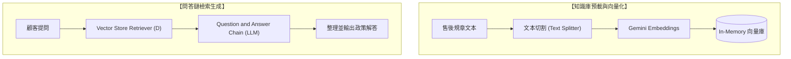

# 基礎 Question and Answer Chain 智慧問答系統

> **作者**：甄珠莉  
> **專案類型**：n8n 自動化流程 + LangChain Q&A Chain + In-Memory 向量資料庫 + 售後政策問答  
> **工作流程檔案**：[`基礎_Question_and_Answer_Chain.json`](./基礎_Question_and_Answer_Chain.json)  
> **作業文件**：[`工作流作業_20260917.pdf`](./工作流作業_20260917.pdf)

---

## 專案簡介

本專案運用 n8n 整合進階 LangChain 模組，建置標準的 **RAG（檢索增強生成）問答鏈** 系統。

工作流程首先預載企業售後政策規章文本，透過文本切分（Recursive Character Text Splitter）與 Google Gemini Embeddings 寫入 In-Memory Vector Store；當模擬顧客提問進入系統時，由 Question and Answer Chain 配合 Retriever 檢索相關條款，並由 LLM 整理產出標準且專業的售後政策解答。

---

## 系統架構流程圖

