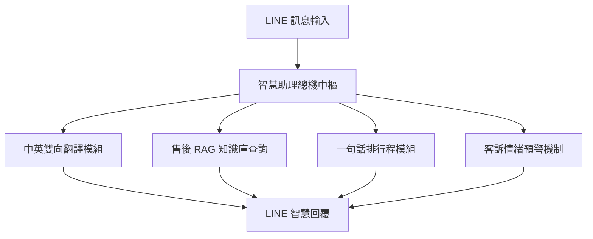

# 智慧客服助理 LINE Bot

> **作者**：林育懿  
> **專案類型**：n8n 自動化應用 + LINE Bot + 多模態與多功能智慧客服整合  
> **使用手冊**：[`20-林育懿.pdf`](./20-林育懿.pdf)

---

## 專案簡介

本專案建置了一個全方位的 **智慧客服助理 LINE Bot**，結合大語言模型與自動化流程，提供多項智慧化服務：
1. **中英雙向翻譯**：利用 Basic LLM Chain 提供即時精準的跨語言轉換。
2. **售後問答 (RAG 知識庫)**：整合售後常見問題與規章，提供 24/7 自動即時解答。
3. **一句話排行程**：透過自然語言抽取會議時間與主題，同步 Google 行事曆。
4. **客訴情緒預警**：自動評估對話情緒，遇強烈抱怨時即刻通報。

---

## 系統核心模組圖

