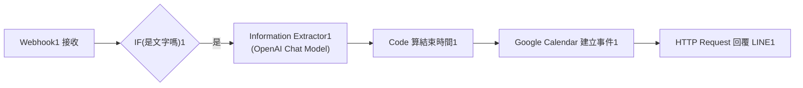

# LINE Calendar 一句話排行程

> **作者**：陳約良  
> **專案類型**：n8n 自動化流程 + LINE Bot + Information Extractor + Google Calendar  
> **工作流程檔案**：[`LINE Calendar.json`](./LINE%20Calendar.json)  
> **流程圖檔案**：[`23-陳約良.pdf`](./23-陳約良.pdf)

---

## 專案簡介

本專案利用 n8n 與 OpenAI 模型實現 LINE 自然語言排行程助理。

當使用者於 LINE 聊天視窗中傳送文字訊息時，流程自動驗證訊息格式，透過 **Information Extractor** 剖析出行程時間與主旨，利用代碼節點精準計算結束時間，並寫入 Google Calendar 建立行事曆事件，最後自動回覆確認訊息給用戶。

---

## 系統架構流程圖

