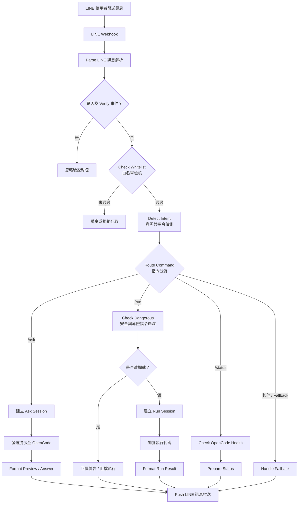

# LINE 連接 OpenCode 自動化互動系統

> **作者**：江家銘  
> **專案類型**：n8n 自動化應用 + LINE Bot + OpenCode 代碼執行與對話引擎  
> **工作流程檔案**：[`line_opencode.json`](./line_opencode.json)

---

## 專案簡介

本專案利用 **n8n** 作為中樞自動化工作流程，整合 **LINE Messaging API** 與本機/容器化部署的 **OpenCode Interpreter 服務**（`http://host.docker.internal:4096`），讓使用者能直接在 LINE 聊天視窗中與 OpenCode 互動，進行自然語言諮詢、程式碼執行、健康狀態檢查與安全的待審核任務調度。

專案具備完善的資安與流程控制機制：
1. **白名單權限控制**：過濾非授權的 LINE 使用者，保障伺服端執行環境安全。
2. **多意圖指令路由**：精準解析使用者輸入（如 `/ask` 提問、`/run` 執行代碼、`/status` 健康檢查等）。
3. **危險指令過濾與暫存審核**：針對高風險代碼與指令進行攔截，並提供暫存與安全回饋機制。
4. **格式化輸出與推送**：自動美化 OpenCode 的輸出結果或執行預覽，透過 LINE Push API 即時回傳給使用者。

---

## 系統架構流程圖

---

## 工作流程節點詳解

1. **LINE Webhook (`webhook`)**
   - 接收來自 LINE Messaging API 的 HTTP POST 請求。

2. **Parse LINE (`code`)**
   - 解析 LINE 事件物件，萃取使用者 ID (`userId`)、訊息類型、文字內容與事件 Token。

3. **Is Verify (`if`) & Check whitelist (`if`)**
   - 排除 Webhook 測試驗證事件；比對發送者 ID 是否位於信任白名單中。

4. **Detect intent (`code`) & Route command (`switch`)**
   - 解析命令前綴與參數，依意圖自動路由至不同處理管道：
     - `/ask`：自然語言問題與諮詢。
     - `/run`：程式碼與腳本執行。
     - `/status`：服務狀態檢查。
     - 其他：智慧問答或回退說明。

5. **OpenCode Session 管理 (`httpRequest`)**
   - 與 OpenCode API（`http://host.docker.internal:4096`）互動，包含建立對話 Session (`/session`) 與發送指令 (`/session/:id/message`)。

6. **Check dangerous & Is Blocked (`code` / `if`)**
   - 對 `/run` 送入的程式碼進行敏感語法比對，阻擋潛在破壞性操作。

7. **Format Result / Preview (`code`)**
   - 整理 OpenCode 運算回傳的文字、標準輸出或錯誤資訊，編排適合 LINE 閱讀的排版。

8. **Push LINE (`httpRequest`)**
   - 調用 LINE Push Message API (`https://api.line.me/v2/bot/message/push`) 將結果即時推送給使用者。

---

## 快速上手與操作指南

### 1. 環境前置需求
- 已安裝並運行 n8n 環境。
- 已在本機或 Docker 啟動 OpenCode 服務（預設埠號 4096）。
- LINE Developers 帳號，並取得 Channel Access Token 與 Webhook 設定權限。

### 2. 匯入與設定工作流程
1. 將 [`line_opencode.json`](./line_opencode.json) 匯入 n8n。
2. 於節點中填入 LINE Channel Access Token 與授權的白名單 User ID。
3. 確保 OpenCode API 端點可被 n8n 存取。
4. 啟動工作流程並將 n8n Webhook 網址填入 LINE Developer Console。

---

## 注意事項
- **安全性**：代碼執行具備高權限特性，務必設定嚴謹的白名單與環境隔離。
- **網路連線**：若 n8n 運行於 Docker 中，需確認 `host.docker.internal` 是否可正確解析本機宿主機網路。
