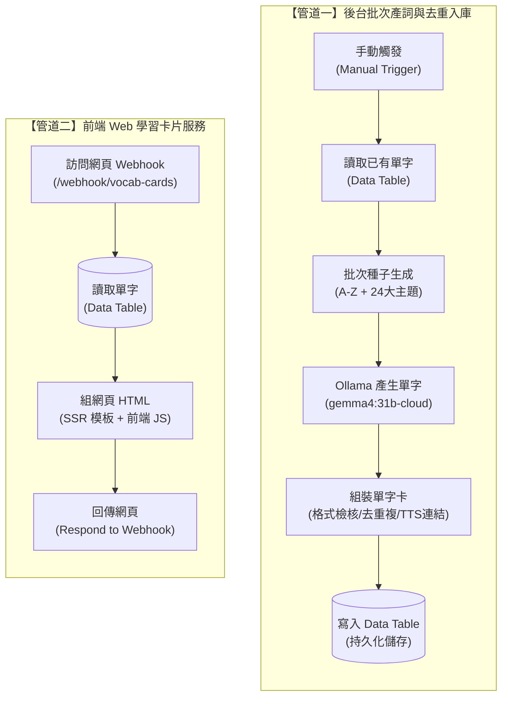

# 英文單字卡 1000 - 分批去重版

> **作者**：江家銘  
> **專案類型**：n8n 自動化應用 + AI 生成 + 互動式 Web 學習單字卡  
> **工作流程檔案**：[`英文單字卡1000-分批去重版.json`](./英文單字卡1000-分批去重版.json)

---

## 專案簡介

本專案是一個利用 **n8n** 整合 **Ollama (LLM)** 與 **n8n 內建 Data Table** 的全自動化英文學習單字庫建置與複習系統。

系統主要解決了常見的「單字重複產生」、「資料格式混亂」與「缺乏互動複習介面」等問題：
1. **AI 智慧擴充**：透過 26 個英文字母與 24 種生活/職場主題種子，批次引導 LLM（如 `gemma4:31b-cloud`）產出適合高中至多益（TOEIC）難度的常用單字與例句。
2. **雙重去重與資料清洗**：比對既有單字資料庫並過濾同批重複項，同時自動掛載 Google TTS 線上發音連結與繁中詞性標籤。
3. **無伺服器 Web 學習介面**：利用 n8n Webhook 與 SSR（Server-Side Rendering）動態輸出美觀流暢的響應式單字卡網頁，支援隨機抽考、發音播放、即時搜尋與進度記憶。

---

## 系統架構流程圖

整個 n8n 工作流程包含兩大獨立管道：



---

## 工作流程節點詳解

### 管道一：AI 批次產詞與資料清洗去重入庫

1. **When clicking ‘Execute workflow’ (`manualTrigger`)**
   - 批次任務的起點，由管理員在 n8n 手動執行以擴增單字庫。

2. **讀取已有單字 (`dataTable`)**
   - 從 n8n 內建的 Data Table 取得目前已收錄的所有單字，提供給後續節點比對，避免重複生成與寫入。

3. **批次種子 (`code`)**
   - 建立高多樣性的提示詞種子（Seeds）：
     - **字母維度**：A 至 Z 共 26 個首字母提示。
     - **主題維度**：涵蓋 24 個主題（如職場溝通、商務書信、求職面試、會議簡報、科技網路、餐飲美食、健康醫療、旅遊交通等）。
   - 每個種子作為獨立項目依序驅動 LLM 產詞。

4. **Ollama 產生單字 (`@n8n/n8n-nodes-langchain.ollama`)**
   - 呼叫 Ollama 模型（例如 `gemma4:31b-cloud`），設定 `temperature: 0.9` 與 JSON 輸出格式。
   - 要求模型針對種子提示產出 40 個符合台灣高中至多益程度、非極端常見字（排除 the/be 等）的單字，包含繁體中文解釋、詞性與自然情境例句。
   - 具備自動重試機制（重試 3 次，間隔 2 秒），提高批次穩定度。

5. **組裝單字卡 (`code`)**
   - **格式解析與容錯**：解析 Markdown 代碼塊或純 JSON，防止格式異常。
   - **嚴格驗證**：利用正規表達式確認單字格式合法性（排除符號或異常長度）。
   - **雙重去重**：
     - 比對 Data Table 的歷史單字（忽略大小寫）。
     - 比對同一批次內是否重複出現。
   - **欄位擴充**：
     - 自動生成 Google TTS 發音連結：`https://translate.google.com/translate_tts?ie=UTF-8&tl=en&client=tw-ob&q={word}`。
     - 預設學習進度為「不熟」。

6. **寫入 Data Table (`dataTable`)**
   - 將清洗後合格且不重複的單字自動新增至 Data Table。

---

### 管道二：前端 Web 互動單字卡服務

1. **單字卡網頁入口 (`webhook`)**
   - 接收 HTTP GET 請求，路徑為 `/webhook/vocab-cards`。
   - 採用 `responseNode` 模式，由工作流程自行渲染並回應用戶端。

2. **讀取單字 (`dataTable`)**
   - 即時讀取 Data Table 中所有的單字資料。

3. **組網頁 HTML (`code`)**
   - 動態編譯並回傳單頁 Web App（HTML + CSS + JavaScript），特色功能包含：
     - **防 XSS 注入**：所有文字屬性皆經過字元轉義處理。
     - **語音播放**：卡片內建 `<audio>` 播放器，可直接點擊發音。
     - **即時搜尋**：輸入英文或中文，即時過濾匹配卡片。
     - **隨機抽卡**：提供「隨機抽卡」按鈕，可將隨機選中的卡片置頂放大複習。
     - **學習狀態記憶**：支援標記「已會」或「不熟」，並將學習記錄儲存於瀏覽器 `localStorage`，重新整理頁面依然保留進度。

4. **回傳網頁 (`respondToWebhook`)**
   - 回傳 `200 OK`，並設定 Header `Content-Type: text/html; charset=utf-8`，讓使用者以瀏覽器直接開箱使用。

---

## 資料表（Data Table）結構設計

| 欄位名稱 (`id`) | 類型 (`type`) | 說明 | 範例 |
| :--- | :--- | :--- | :--- |
| `word` | `string` | 英文單字 | `polish` |
| `meaning_zh` | `string` | 繁體中文解釋 | `擦亮、改進` |
| `pos` | `string` | 詞性（繁體中文） | `動詞` |
| `example_en` | `string` | 實用英文生活/商務例句 | `You should polish your English speaking skills before going abroad.` |
| `progress` | `string` | 預設學習進度 | `不熟` |
| `tts_url` | `string` | 線上真人發音連結 | `https://translate.google.com/translate_tts?...&q=polish` |
| `extra` | `string` | 補充說明/個人備註 | *(預設為空)* |

---

## 快速上手與操作指南

### 1. 執行與匯入工作流程
1. 將本專案的 [`英文單字卡1000-分批去重版.json`](./英文單字卡1000-分批去重版.json) 匯入至您的 n8n 實例中。
2. 建立 n8n Data Table，並對應建立上述欄位結構（或替換節點中的 `dataTableId`）。
3. 設定 Ollama 憑證與可用的 LLM 模型。
4. 點擊 `When clicking 'Execute workflow'` 執行一次，系統將自動擴增單字庫。

### 2. 開啟單字卡網頁
啟動 Webhook 後，可使用 n8n 提供的 Webhook URL 或透過 ngrok 等穿透工具公開網址，例如：
```text
https://<你的網域或-ngrok-網址>/webhook/vocab-cards
```

### 3. 操作步驟
1. **瀏覽與搜尋**：在上方搜尋欄輸入中英文，即時篩選特定單字。
2. **隨機抽卡**：點擊「隨機抽卡」按鈕，系統會在最上方顯示單一抽考卡片。
3. **播放發音**：點擊卡片上的音訊播放鍵聆聽單字發音。
4. **狀態標記**：複習後點擊「已會」或「不熟」，進度會立即更新並保存在本機瀏覽器。
5. **循環學習**：重複點選「隨機抽卡」繼續下一輪複習。

---

## 注意事項與已知限制
- **學習進度保存**：使用者的「已會 / 不熟」狀態儲存在瀏覽器的 `localStorage` 中，更換瀏覽器或裝置時不會自動跨端同步。
- **TTS 音訊服務**：發音來源使用 Google TTS 公開端點，若網路環境受限或 API 頻率超限可能影響播放。