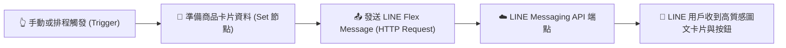

# LINE 整合實作
## 範例 4：LINE Flex Message 互動圖文卡片設計（進階 JSON 視覺化訊息）

### 📚 工作流程說明

這個 n8n 工作流程示範如何使用 **LINE Flex Message** 技術發送客製化、高質感的互動圖文卡片。Flex Message 是 LINE 官方最具彈性與視覺表現力的訊息格式，透過類似 HTML/CSS 的 JSON 佈局結構（包含 Header、Hero 圖片、Body 內文、Footer 按鈕區塊），可打造出如電商商品展示、活動邀請函、訂單明細與天氣資訊卡等具備專業 APP 質感的互動體驗。

---

### 流程架構圖



---

### 工作流程樣版下載

- [📥 LINE Flex Message 圖文卡片工作流程樣版 (line_flex_message.json)](./line_flex_message.json)

---

#### 📋 節點詳細說明

1. **📝 流程說明（Sticky Note）**
   - **功能**：說明 Flex Message 的 Bubble JSON 容器結構與各區塊功能。

2. **👆 手動觸發測試（Manual Trigger Node）**
   - **功能**：點擊「Execute Workflow」手動執行測試（亦可替換為 Schedule Trigger 定時推播或 Webhook 接收後回覆）。

3. **📝 準備商品卡片資料（Edit Fields / Set Node）**
   - **功能**：定義圖文卡片所需的動態內容與目標 User ID：
     - `targetUserId`：接收推播的 LINE User ID。
     - `cardTitle`：卡片主標題（例如：商品名稱）。
     - `cardSubtitle`：副標題或優惠標籤。
     - `cardPrice` / `originalPrice`：特惠價與原價（支援刪除線排版）。
     - `imageUrl`：Hero 圖片網址（建議比例 20:13 或 1:1）。
     - `actionUrl`：點擊卡片或按鈕時跳轉的目的地 URL。

4. **📤 發送 LINE Flex Message（HTTP Request Node）**
   - **功能**：呼叫 LINE Messaging API 的 `push`（或 `reply`）端點傳送 `type: "flex"` 的 JSON 結構。
   - **設定要點**：
     - **Method**：`POST`
     - **URL**：`https://api.line.me/v2/bot/message/push`（若是回覆使用者則為 `/reply`）
     - **Authentication**：選擇 `Predefined Credential Type` -> `Header Auth`。
     - **JSON Body 核心架構**：
       ```json
       {
         "to": "={{ $json.targetUserId }}",
         "messages": [
           {
             "type": "flex",
             "altText": "🎉 您的專屬優惠商品推薦：{{ $json.cardTitle }}",
             "contents": {
               "type": "bubble",
               "hero": {
                 "type": "image",
                 "url": "={{ $json.imageUrl }}",
                 "size": "full",
                 "aspectRatio": "20:13",
                 "aspectMode": "cover"
               },
               "body": { ... },
               "footer": { ... }
             }
           }
         ]
       }
       ```

---

#### 🎯 學習重點

- **Flex Message JSON 結構剖析**：掌握 `bubble` 容器的 `hero`（封面圖）、`body`（排版核心）與 `footer`（操作按鈕）三大區塊。
- **替代文字 (Alt Text) 重要性**：理解在聊天清單或不支援 Flex 的裝置上，`altText` 是用戶唯一看得到的預覽文字。
- **Flex Message Simulator 工具運用**：學會使用 LINE 官方提供的 [Flex Message Simulator](https://developers.line.biz/console/fx/) 視覺化設計工具產生 JSON 範本，再將變數動態填入 n8n。
- **互動 Action 設定**：配置跳轉外部網頁（`uri`）、傳送文字訊息（`message`）或發送隱藏回傳參數（`postback`）等多種互動按鈕。

---

#### 💡 實際應用場景

- **電商熱門商品與折扣推播**：以圖文並茂的卡片推送最新上市商品與優惠券領取按鈕。
- **餐廳 / 診所預約確認單**：將預約日期、時間、醫師/包廂資訊組合成精美的確認憑證卡片。
- **訂單物流出貨進度卡**：即時發送物流追蹤編號、配送狀態與包裹明細。

---

#### ⚙️ 設定步驟

1. **確認 Header Auth 憑證**：請確保已依照 **[📱 LINE 設定指南](../../../line設定/README.md)** 在 n8n 中建立了 `Header Auth` 憑證。
2. **匯入工作流程**：下載並將 [`line_flex_message.json`](./line_flex_message.json) 匯入至 n8n。
3. **填入目標 User ID**：在「準備商品卡片資料」節點中，將 `targetUserId` 填入您的 LINE User ID（以 `U` 開頭的 33 碼字串）。
4. **綁定憑證與執行**：在「發送 LINE Flex Message」節點確認選取 Header Auth 憑證，點擊「Execute Workflow」即可在 LINE 收到高質感的商品卡片！
