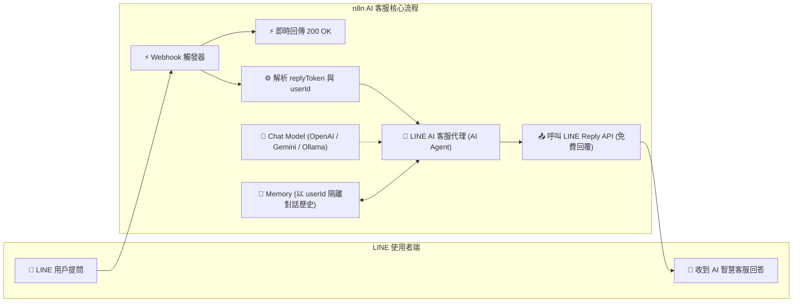

# LINE 整合實作
## 範例 5：LINE 整合 AI 智慧客服助理（含對話記憶與免費回覆）

### 📚 工作流程說明

這個 n8n 工作流程示範如何將 LINE 官方帳號升級為具備上下文記憶能力的 **AI 智能客服助理**。透過結合 **Webhook 接收**、**即時 200 OK 應答**、**LangChain AI Agent**、大型語言模型（OpenAI GPT-4o-mini、Google Gemini 或本地 Ollama）與 **Window Buffer Memory（對話記憶）**，並在推論完成後透過 **LINE Reply API** 將 AI 生成的繁體中文回答**完全免費**地送回給使用者，打造出企業級的智慧客服閉環。

---

### 流程架構圖



---

### 🔗 Webhook URL 綁定設定

在 n8n 匯入工作流程並綁定 Header Auth 憑證後，請依序完成工作流程發布（Publish）與 Webhook 網址綁定：

> [!IMPORTANT]
> **必須先將工作流程設為 Published（正式啟用）！**
> LINE Developers 的 Webhook 驗證（Verify）與真實訊息接收，**必須使用 Production URL（正式發布網址）** 且工作流程處於 **Published / Active** 狀態下才能成功回應 200 OK。

1. **發布工作流程（Publish）**：點擊畫布右上角的 **Publish** 開關。
2. **複製 Production Webhook URL**：點開「LINE Webhook 觸發器」節點，切換至 **Production URL** 分頁複製網址。
3. **貼至 LINE Developers Console**：進入 Messaging API 分頁 ➔ 填入 Webhook URL ➔ 開啟 Use Webhook ➔ 點擊 **Verify** 確認出現 `Success`。

---

### 工作流程樣版下載

- [📥 LINE 整合 AI 智慧客服助理樣版 (line_ai_agent.json)](./line_ai_agent.json)

---

#### 📋 節點詳細說明

1. **📝 流程說明（Sticky Note）**
   - **功能**：說明 Webhook 接收、AI Agent 推論、記憶隔離與 Reply API 免費回傳的架構。

2. **⚡ LINE Webhook 觸發器（Webhook Node）**
   - **功能**：監聽 LINE 伺服器傳入的 POST 請求（Path 設為 `line-ai-webhook`）。

3. **⚡ 即時回傳 200 OK（Respond to Webhook Node）**
   - **功能**：立即向 LINE 伺服器回覆 HTTP 200 `{"status": "ok"}`，避免重試風暴。

4. **⚙️ 解析 LINE 訊息事件（Code Node）**
   - **功能**：從 Payload 中提取關鍵欄位：
     - `userId`：發訊者專屬識別碼（格式為 `U` 開頭 33 碼）。
     - `replyToken`：用於免費回覆此則訊息的權杖（有效時效約 1 分鐘）。
     - `userMessage`：使用者傳送的文字提問。
     - `messageType`：訊息類型（如 `text`）。

5. **🔀 是否為文字訊息？（IF Node）**
   - **功能**：確保只有文字訊息進入 AI 處理流程，過濾貼圖、圖片等非文字事件。

6. **🤖 LINE AI 客服代理（AI Agent Node）**
   - **功能**：結合提示詞、對話歷史與 LLM 進行問答推論。
   - **System Prompt 設定**：
     ```text
     你是一位專業、親切且高效的 LINE 官方客服智慧助理。請遵循以下規則：
     1. 必須一律使用「繁體中文（台灣習慣用語）」進行回覆。
     2. 語氣親切有禮，可適度使用 emoji 增加互動質感。
     3. 回答簡潔明瞭、重點突出，避免冗長無重點的文字。
     4. 若使用者提及先前的提問，請參考對話歷史記憶進行連貫回應。
     ```

7. **🧠 語言模型（OpenAI Chat Model / Gemini / Ollama）**
   - **功能**：提供推論算力（預設 `gpt-4o-mini`，亦可無縫換為 Google Gemini 或本機免費 Ollama 模型）。

8. **💾 對話記憶（Window Buffer Memory Node）**
   - **功能**：以 `userId` 為 Session Key：
     - **Session Key**：`={{ $('解析 LINE 訊息事件').item.json.userId }}`
     - **作用**：確保不同用戶在官方帳號發問時，各自保有獨立的對話上下文記憶，互不干擾。

9. **📤 呼叫 LINE Reply API 免費回傳（HTTP Request Node）**
   - **功能**：將 AI 生成的文字回答（`{{ $json.output }}`）透過 Reply API 送回：
     - **Method**：`POST`
     - **URL**：`https://api.line.me/v2/bot/message/reply`
     - **Header Auth**：綁定 LINE Messaging API 的 `Authorization: Bearer <Token>` 憑證。
     - **成本**：**完全免費，不扣除官方帳號任何推播額度！**

---

#### 🎯 學習重點

- **零成本 AI 客服架構**：深刻理解 LINE Reply API 搭配 AI Agent 的免費商用價值。
- **Session Key 隔離多用戶記憶**：掌握在即時通訊機器人中以 `userId` 作為記憶隔離識別碼的方法。
- **防止 Webhook 逾時最佳實踐**：非同步即時回傳 200 OK，讓後續 AI 推論在安全時間窗（1 分鐘 ReplyToken 時效）內順暢執行。
- **繁體中文客服人設設計**：編寫符合在地化商業口吻的 System Prompt。

---

#### 💡 實際應用場景

- **24/7 全天候 LINE 官方帳號客服**：自動解答常見業務諮詢、商品規格、營業時間與門市地址。
- **多輪對話式預約 / 諮詢助理**：引導顧客一步步提供需求、日期與人數，完成售前諮詢。
- **企業內部知識庫問答**：將員工 LINE 群組與內部 FAQ 知識庫串接，提供即時運維解答。

---

#### ⚙️ 設定步驟

1. **確認憑證**：確認 n8n 已建立 `LINE Header Auth` 憑證與 `OpenAI API`（或 Gemini）憑證。
2. **匯入工作流程**：下載並將 [`line_ai_agent.json`](./line_ai_agent.json) 匯入至 n8n。
3. **綁定憑證與網址**：
   - 在「呼叫 LINE Reply API」節點選取 Header Auth 憑證。
   - 在「OpenAI Chat Model」節點選取 OpenAI 憑證。
   - 將工作流程設為 **Active (Published)**，並在 LINE Developers 設定 Webhook URL。
4. **測試連續對話**：在手機 LINE 傳送：「你好，我是王大明」，接著再問：「請問你還記得我的名字嗎？」，驗證 AI 記憶與流暢回覆！
