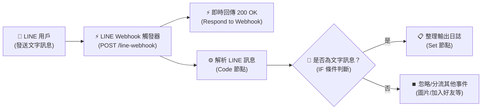

# LINE 整合實作
## 範例 1：LINE 訊息觸發 n8n 工作流程

### 📚 工作流程說明

這個 n8n 工作流程示範如何透過 **LINE Webhook** 接收使用者傳送至 LINE 官方帳號的訊息，並在 n8n 中自動解析出關鍵欄位（例如：使用者 ID、訊息文字、ReplyToken、群組 ID 與事件類型），為後續的資料庫儲存、商業邏輯分流或 AI 智慧對話奠定基礎。

---

### 流程架構圖



---

### 工作流程樣版下載

- [📥 LINE 訊息觸發工作流程樣版 (line_webhook_trigger.json)](./line_webhook_trigger.json)

---

#### 📋 節點詳細說明

1. **📝 流程說明（Sticky Note）**
   - **功能**：畫布上的備忘說明，標示各階段處理重點。

2. **⚡ LINE Webhook 觸發器（Webhook Node）**
   - **功能**：工作流程的起點，監聽 LINE 伺服器推播的 HTTP POST 請求。
   - **設定要點**：
     - **HTTP Method**：`POST`
     - **Path**：`line-webhook`
     - **Response Mode**：`Using 'Respond to Webhook' Node`（非同步即時回應模式）

3. **⚡ 即時回傳 200 OK（Respond to Webhook Node）**
   - **功能**：立即向 LINE 伺服器回覆 HTTP 200 `{"status": "ok"}`。
   - **重要性**：LINE 伺服器若在 1 秒內未收到 200 回應，會判定傳輸失敗並持續重發 Webhook，造成流程重複執行。

4. **⚙️ 解析 LINE 訊息（Code Node）**
   - **功能**：從 LINE Webhook 傳入的 `events` 陣列中提取關鍵參數：
     - `userId`：發送訊息的使用者專屬識別碼（格式為 `U` 開頭的 33 碼字串）。
     - `userMessage`：使用者輸入的文字內容。
     - `replyToken`：用於免費被動回覆此則訊息的權杖（有效時效約 1 分鐘）。
     - `messageType`：訊息類型（如 `text`、`image`、`sticker` 等）。
     - `eventType`：事件類型（如 `message`、`follow`、`unfollow` 等）。

5. **🔀 是否為文字訊息？（IF Node）**
   - **功能**：判斷 `$json.messageType` 是否等於 `text`，確保只有文字訊息進入主處理管線，避免圖片或貼圖造成後續字串處理錯誤。

6. **📋 整理輸出日誌（Edit Fields / Set Node）**
   - **功能**：將解析出的使用者與訊息內容整理為結構化的輸出物件，方便後續工作流程調用或寫入日誌。

---

#### 🎯 學習重點

- **Webhook 接收機制**：理解 LINE 如何以 JSON Payload 即時推送事件給 n8n。
- **即時回應 200 原理**：掌握使用 `Respond to Webhook` 節點避免伺服器重試風暴的最佳實踐。
- **LINE 關鍵參數辨識**：熟悉 `userId`（用戶標識）與 `replyToken`（免費回覆憑據）的用途。
- **條件分流**：使用 IF 節點依照訊息型態進行分流處理。

---

#### 💡 實際應用場景

- **LINE 官方帳號客服監聽**：即時接收客戶提問並轉發至團隊 Telegram 或 Slack。
- **客戶資料自動建檔**：擷取用戶傳送的姓名、電話或預約資訊，寫入 Google Sheets 或 Supabase。
- **AI 智能客服入口**：作為對話機器人的接收起點，將 `userMessage` 送入 AI Agent 生成回覆。

---

#### ⚙️ 設定步驟

1. **取得前置設定**：請確保已依照 **[📱 LINE 設定指南](../../../line設定/README.md)** 建立好 Channel 並掃描 QR Code 加機器人為好友。
2. **匯入工作流程**：在 n8n 介面點選 **Import from File** 匯入 [`line_webhook_trigger.json`](./line_webhook_trigger.json)。
3. **複製 Webhook URL**：
   - 點開「LINE Webhook 觸發器」節點，複製 **Production URL**（例如：`https://<你的網域>/webhook/line-webhook`）或測試用的 **Test URL**。
4. **貼至 LINE Developers**：
   - 登入 LINE Developers Console，進入 **Messaging API** 分頁。
   - 在 **Webhook URL** 貼上網址，開啟 **Use webhook** 並點擊 **Verify** 確認回傳 Success。
5. **發送訊息測試**：使用手機 LINE 傳送文字訊息給官方帳號，即可在 n8n 觀察到工作流程被即時觸發！

---

<details>
<summary>🤖 <strong>AI 賦能延伸實作（附 Prompt 提詞）</strong></summary>

> 💡 **任務目標 1：透過 MCP 從零建立此工作流程**
> 只要複製下方 Prompt，AI 即可在您的 n8n 畫布上全自動建構出此工作流程。

**可直接複製給 AI 的 Prompt 提詞（建立工作流）**：
```text
請在我的 n8n 畫布上從無到有建立一個「LINE 訊息接收與解析」工作流程：
1. 新增 Webhook 觸發節點：
   - HTTP Method 設為 POST。
   - Path 設為 line-webhook。
   - Response Mode 設為 Using 'Respond to Webhook' Node。
2. 連接 Respond to Webhook 節點，立即回傳 JSON {"status": "ok"}。
3. 同時連接 Code 節點，JavaScript 邏輯需解析 $input.first().json.body.events[0]，提取出 eventType, messageType, userMessage, replyToken, userId。
4. 連接 IF 節點，判斷 messageType 是否等於 "text"。
5. 在 True 分支連接 Edit Fields (Set) 節點，輸出包含 status: "處理成功" 與 logSummary: "收到來自 {{ $json.userId }} 的訊息：{{ $json.userMessage }}"。
請幫我建立所有節點並完成連線！
```

---

> 💡 **任務目標 2：升級為 AI 智慧問答機器人（串接 LLM 與 Reply API）**
> 結合大型語言模型（OpenAI / Gemini / Ollama），將用戶輸入即時交給 AI 回覆，並透過 LINE Reply API 免費送回給使用者。

**可直接複製給 AI 的 Prompt 提詞（串接 AI 智慧回覆）**：
```text
請幫我在目前的「LINE 訊息接收工作流程」後面升級加入 AI Agent 智慧問答與自動回覆：
1. 接在「是否為文字訊息」的 True 分支後面。
2. 新增 AI Agent（或 Basic LLM Chain）節點：
   - 串接 Chat Model（例如 Gemini Chat Model 或 OpenAI Chat Model）。
   - System Prompt 設定為：「你是一個親切專業的 LINE 智能助手，請使用繁體中文，以簡潔且有條理的語氣回覆使用者的提問。」
   - 將使用者的 {{ $json.userMessage }} 作為 Prompt 輸入。
3. 在 AI 節點後接續新增一個 HTTP Request 節點（呼叫 LINE Reply API）：
   - Method: POST
   - URL: https://api.line.me/v2/bot/message/reply
   - Authentication: 選擇 Header Auth（使用已建立的 Authorization: Bearer <Channel Access Token> 憑證）。
   - Body (JSON):
     {
       "replyToken": "={{ $('解析 LINE 訊息').item.json.replyToken }}",
       "messages": [
         {
           "type": "text",
           "text": "={{ $json.text || $json.output }}"
         }
       ]
     }
請直接幫我在畫布上建立並完成串接！
```
</details>
