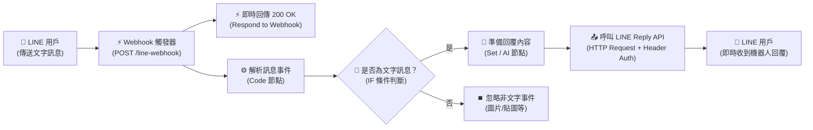

# LINE 整合實作
## 範例 3：LINE 雙向通訊與自動回覆（Bot 完整對話流程）

### 📚 工作流程說明

這個 n8n 工作流程整合了「**接收訊息 (Webhook)**」與「**即時回覆 (Reply API)**」，打造一個完整的 LINE 雙向通訊自動化工作流程。當使用者在 LINE 傳送訊息時，流程會即時接收、解析訊息內容，並在 1 分鐘內使用 `replyToken` 免費回覆訊息給使用者。此工作流程也是後續升級為 **LINE AI 智能客服助理** 的核心骨幹。

---

### 流程架構圖



---

### 工作流程樣版下載

- [📥 LINE 雙向通訊工作流程樣版 (line_bot_workflow.json)](./line_bot_workflow.json)

---

#### 📋 節點詳細說明

1. **📝 流程說明（Sticky Note）**
   - **功能**：畫布上的步驟摘要說明。

2. **⚡ LINE Webhook 觸發器（Webhook Node）**
   - **功能**：接收來自 LINE 伺服器的事件 Payload。
   - **設定要點**：`POST` 方法，Path 為 `line-webhook`，Response Mode 為 `Using 'Respond to Webhook' Node`。

3. **⚡ 即時回傳 200 OK（Respond to Webhook Node）**
   - **功能**：即時回傳 `{"status": "ok"}` 給 LINE 伺服器，避免因逾時重試造成重複執行。

4. **⚙️ 解析 LINE 訊息事件（Code Node）**
   - **功能**：從 Payload 中提取 `replyToken`、`userId`、`userMessage` 與 `messageType` 等核心欄位。

5. **🔀 是否為文字訊息？（IF Node）**
   - **功能**：確保只有文字訊息進入回覆階段，非文字訊息進行分流或略過。

6. **📝 準備回覆內容（Edit Fields / Set Node）**
   - **功能**：組合回覆字串 `replyText`（例如：「您好！n8n 已收到您的訊息：...」），並保留 `replyToken` 與 `userId`。

7. **📤 呼叫 LINE Reply API（HTTP Request Node）**
   - **功能**：調用 LINE 官方回覆端點發送訊息。
   - **設定要點**：
     - **Method**：`POST`
     - **URL**：`https://api.line.me/v2/bot/message/reply`
     - **Authentication**：選擇 `Predefined Credential Type` -> `Header Auth`（使用在 [LINE 設定指南](../../../line設定/README.md#步驟-4在-n8n-設定-header-auth-憑證與發送訊息) 中建立的 `Authorization` 憑證）。
     - **JSON Body**：
       ```json
       {
         "replyToken": "={{ $json.replyToken }}",
         "messages": [
           {
             "type": "text",
             "text": "={{ $json.replyText }}"
           }
         ]
       }
       ```

---

#### 🎯 學習重點

- **雙向閉環通訊**：理解從「接收 Webhook」到「呼叫 Reply API 回傳」的完整生命週期。
- **免費被動回覆（Reply API）優勢**：在 1 分鐘內使用 `replyToken` 回覆，**完全免費且無訊息則數限制**。
- **Header Auth 憑證複用**：多個 HTTP Request 節點均可共用同一組 Header Auth 憑證。
- **AI 擴充基石**：隨時可將「準備回覆內容」節點無縫替換為「AI Agent」或「LangChain」節點。

---

#### 💡 實際應用場景

- **LINE 智能對話機器人**：接收顧客問題並即時給予解答。
- **關鍵字自動回覆系統**：判斷用戶輸入關鍵字（如「營業時間」、「菜單」、「地址」），回傳對應圖文。
- **結合企業知識庫（RAG）**：將用戶問題轉送向量資料庫（如 Supabase / Pinecone）查詢後回覆。

---

#### ⚙️ 設定步驟

1. **確認前置憑證**：請確保已依照 **[📱 LINE 設定指南](../../../line設定/README.md)** 在 n8n 中建立了 `Header Auth` 憑證。
2. **匯入工作流程**：在 n8n 介面點選 **Import from File** 匯入 [`line_bot_workflow.json`](./line_bot_workflow.json)。
3. **綁定憑證**：點開「呼叫 LINE Reply API」節點，在 Authentication 選取您的 Header Auth 憑證。
4. **設定 Webhook**：將 Webhook URL 填入 LINE Developers Console 的 Webhook URL 欄位並點擊 Verify。
5. **對話測試**：開啟手機 LINE，向您的官方帳號發送任何文字訊息，機器人即會自動秒回！

---

<details>
<summary>🤖 <strong>AI 賦能延伸實作（附 Prompt 提詞）</strong></summary>

> 💡 **任務目標 1：透過 MCP 從零建立此雙向工作流程**
> 複製下方 Prompt，AI 即可在您的 n8n 畫布上全自動建構出此工作流程。

**可直接複製給 AI 的 Prompt 提詞（建立雙向工作流）**：
```text
請在我的 n8n 畫布上從無到有建立一個「LINE 雙向通訊與自動回覆」工作流程：
1. 新增 Webhook 觸發器（POST /line-webhook，Using 'Respond to Webhook' Node）。
2. 連接 Respond to Webhook 節點（回傳 {"status": "ok"}）。
3. 同時連接 Code 節點，解析 events[0] 中的 replyToken, userId, userMessage, messageType。
4. 連接 IF 節點，條件為 messageType 等於 "text"。
5. 在 True 分支連接 Set 節點，組合 replyText: "您好！已收到您的訊息：「{{ $json.userMessage }}」" 並傳遞 replyToken。
6. 最後連接 HTTP Request 節點（POST https://api.line.me/v2/bot/message/reply），使用 Header Auth 憑證，並將 replyToken 與 replyText 填入 JSON Body。
請幫我建立所有節點並完成連線！
```

---

> 💡 **任務目標 2：升級為 AI 智慧問答客服（串接 LLM Agent 與記憶）**
> 將 Set 節點替換為 AI Agent，具備多輪對話記憶與人格設定。

**可直接複製給 AI 的 Prompt 提詞（升級為 AI Agent 客服）**：
```text
請幫我將目前的「LINE 雙向通訊工作流程」升級為「AI 智能客服助理」：
1. 移除或繞過原本的 Set 節點。
2. 在「是否為文字訊息」的 True 分支後新增 AI Agent 節點：
   - 串接 Chat Model（Gemini 或 OpenAI GPT-4o-mini）。
   - 串接 Window Buffer Memory（Session Key 使用 {{ $('解析 LINE 訊息事件').item.json.userId }}）。
   - System Prompt：「你是一個專業親切的 LINE 官方客服助理，請用繁體中文以簡潔清晰的語氣回覆顧客問題。」
   - 用戶輸入填入：{{ $('解析 LINE 訊息事件').item.json.userMessage }}
3. 將 AI Agent 的回覆內容傳入後續的 HTTP Request 節點（LINE Reply API），回傳 AI 產生的解答文字。
請直接幫我在畫布上調整並完成連線！
```
</details>
