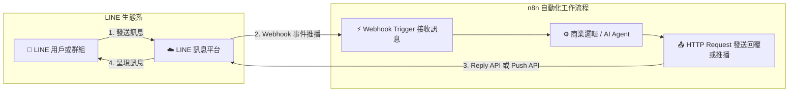

# 📱 LINE Messaging API 整合實作

歡迎來到 LINE Messaging API 與 n8n 整合教學！本章節帶您深入了解如何將 LINE 官方帳號與 n8n 工作流程串接，實現「**接收 LINE 訊息觸發 n8n**」與「**n8n 呼叫 LINE 發送/回覆訊息**」的完整雙向通訊自動化。

> 💡 **AI 協作時代學習法**：在完成基礎節點設定並透過 MCP 連線 AI（Gemini、ChatGPT 或 Claude）後，您可以直接複製各範例中的 **「AI 賦能延伸實作」** 折疊區塊（`<details>`）內的 Prompt 提詞，由 AI 助理替您在畫布上全自動建構工作流程與串接 LLM 對話模型！

---

## 🛠️ 前置設定指南

在開始建置工作流程前，您需要完成 LINE Developers 帳號申請、建立 Messaging API Channel、掃描 QR Code 加好友/群組，以及在 n8n 中設定 Header Auth 憑證。

> 📌 **完整圖文設定指南**：
> 請直接參閱 **[📱 LINE Messaging API 設定指南（圖文完整版）](../../line設定/README.md)**，內含逐步截圖操作說明：
> 1. [建立 LINE Messaging API Channel](../../line設定/README.md#步驟-1建立-line-messaging-api-channel)
> 2. [取得 Channel 憑證（Secret 與 Access Token）](../../line設定/README.md#步驟-2取得-channel-憑證)
> 3. [設定 Webhook 與掃描 QR Code 加入好友/群組](../../line設定/README.md#步驟-3在-line-設定-webhook-與加入好友群組接收訊息進-n8n)
> 4. [在 n8n 設定 Header Auth 憑證](../../line設定/README.md#步驟-4在-n8n-設定-header-auth-憑證與發送訊息)

---

## 🎯 整合核心架構



---

## 📚 實作範例導覽

本教學規劃了三個循序漸進的實作範例，從單向觸發、主動推播到完整的雙向自動回覆對話閉環：

---

### 1. [範例 1：LINE 訊息觸發 n8n 工作流程](./LINE訊息觸發工作流/README.md)

學習如何使用 Webhook 節點監聽 LINE 官方帳號接收到的訊息事件，並在 n8n 中解析用戶與訊息資料。

**學習重點**：
- 使用 Webhook 節點接收 LINE 伺服器推播事件
- 使用 Respond to Webhook 節點即時回傳 200 OK，防止重試風暴
- 使用 Code / Set 節點解析 `userId`、`userMessage`、`replyToken`
- 使用 IF 條件節點分流文字訊息與其他事件

<details>
<summary>🤖 <strong>AI 賦能延伸實作（附 Prompt 提詞）</strong></summary>

> 💡 **任務目標**：透過 MCP 連線，讓 AI 自動在畫布上建構出 LINE Webhook 接收與解析工作流程。

**可直接複製給 AI 的 Prompt 提詞**：
```text
請在我的 n8n 畫布上從無到有建立一個「LINE 訊息接收與解析」工作流程：
1. 新增 Webhook 觸發節點：
   - HTTP Method 設為 POST。
   - Path 設為 line-webhook。
   - Response Mode 設為 Using 'Respond to Webhook' Node。
2. 連接 Respond to Webhook 節點，立即回傳 JSON {"status": "ok"}。
3. 同時連接 Code 節點，JavaScript 邏輯需解析 $input.first().json.body.events[0]，提取出 eventType, messageType, userMessage, replyToken, userId。
4. 連接 IF 節點，判斷 messageType 是否等於 "text"。
5. 在 True 分支連接 Edit Fields (Set) 節點，輸出包含 status: "處理成功" 與 logSummary: "收到來自 {{ $json.userId }} 的訊息：{{ $json.userMessage }}"。
請幫我建立所有節點並完成連線！
```
</details>

---

### 2. [範例 2：n8n 節點呼叫 LINE Message 服務（主動推播）](./n8n呼叫LINE發送訊息/README.md)

學習如何透過 HTTP Request 節點搭配 Header Auth 憑證，主動呼叫 LINE Push Message API 發送推播通知。

**學習重點**：
- 手動 (Manual) 或排程 (Schedule) 觸發工作流程
- 使用 Set 節點設定推播目標 `targetUserId` 與訊息內容
- 使用 HTTP Request 節點調用 `https://api.line.me/v2/bot/message/push`
- 正確綁定 Header Auth 憑證 (`Authorization: Bearer <Token>`)

<details>
<summary>🤖 <strong>AI 賦能延伸實作（附 Prompt 提詞）</strong></summary>

> 💡 **任務目標**：透過 MCP 連線，讓 AI 建立每日早上 08:30 自動抓取引言並推播至 LINE 的排程機器人。

**可直接複製給 AI 的 Prompt 提詞**：
```text
請幫我建立一個「每日早上 08:30 AI 晨報推播至 LINE」工作流程：
1. 起點使用 Schedule Trigger 節點，設定為每天早上 08:30 觸發。
2. 串接 HTTP Request 節點，向 https://zenquotes.io/api/random 抓取今日隨機名言。
3. 串接 AI Agent（或 Basic LLM Chain）節點，搭配 Gemini 或 OpenAI Chat Model：
   - 提示詞設定：「請將傳入的英文名言翻譯為繁體中文，並附加一句 30 字以內的今日工作激勵小語，格式排版美觀易讀。」
4. 最後串接 HTTP Request 節點，使用 Header Auth 憑證呼叫 LINE Push API (POST https://api.line.me/v2/bot/message/push)，將 AI 產生的晨報推播給指定的 targetUserId。
請直接幫我在畫布上建立並完成這套自動化流程！
```
</details>

---

### 3. [範例 3：LINE 雙向通訊與自動回覆（Bot 完整對話流程）](./LINE雙向通訊與自動回覆/README.md)

整合「**接收訊息 (Webhook)**」與「**免費即時回覆 (Reply API)**」，建構完整的 LINE Bot 雙向通訊閉環，亦可無縫接入 AI Agent 升級為智慧客服！

**學習重點**：
- 完整雙向通訊架構：接收 Webhook ➔ 解析 ➔ 條件分流 ➔ 呼叫 Reply API
- 使用 `replyToken` 在 1 分鐘內免費被動回覆（完全不計入 LINE 訊息費用額度）
- 透過 Header Auth 憑證安全授權 LINE Messaging API
- 無縫串接 AI Agent (LLM) 與對話記憶 (Memory) 打造智能客服

<details>
<summary>🤖 <strong>AI 賦能延伸實作（附 Prompt 提詞）</strong></summary>

> 💡 **任務目標**：透過 MCP 連線，讓 AI 自動在畫布上建構出完整的雙向自動回覆工作流程，或升級為 AI 智慧問答客服。

**可直接複製給 AI 的 Prompt 提詞（建立雙向工作流）**：
```text
請在我的 n8n 畫布上從無到有建立一個「LINE 雙向通訊與自動回覆」工作流程：
1. 新增 Webhook 觸發器（POST /line-webhook，Using 'Respond to Webhook' Node）。
2. 連接 Respond to Webhook 節點（回傳 {"status": "ok"}）。
3. 同時連接 Code 節點，解析 events[0] 中的 replyToken, userId, userMessage, messageType。
4. 連接 IF 節點，條件為 messageType 等於 "text"。
5. 在 True 分支連接 Set 節點，組合 replyText: "您好！已收到您的訊息：「{{ $json.userMessage }}」" 並傳遞 replyToken。
6. 最後連接 HTTP Request 節點（POST https://api.line.me/v2/bot/message/reply），使用 Header Auth 憑證，並將 replyToken 與 replyText 填入 JSON Body。
請幫我建立所有節點並完成連線！
```
</details>

---

## 💰 LINE 訊息費用與方案額度說明

LINE 官方帳號對於訊息計費的核心邏輯區分為 **Reply (回覆)** 與 **Push (主動推播)**，這是設計自動化流程時最重要的成本考量：

### 1. 訊息類型比較

| 訊息類型 | 觸發方式 | 計費方式 | 配額限制 | 適用場景 |
| :--- | :--- | :--- | :--- | :--- |
| **被動回覆 (Reply API)** | 使用者先發訊息進來，n8n 透過 `replyToken` 回覆 | **完全免費** | **無上限**（不佔用任何方案額度） | AI 客服問答、關鍵字回覆、選單操作互動 |
| **主動推播 (Push API)** | 系統定時或事件觸發，主動發送給特定 `userId` 或群組 | **依方案額度扣抵** | 超過額度需付費或升級方案 | 系統監控警報、定時晨報、訂單出貨通知 |

> ⚠️ **重要注意事項**：
> - `replyToken` 只能使用一次，且時效約 **1 分鐘**。逾期則無法再使用 Reply API 回覆，必須改用 Push API。
> - 只要是「用戶主動發問，機器人即時回覆」的客服對話，**完全不需要擔心 LINE 訊息費用**！

---

### 2. LINE 官方帳號方案額度對照表

| 方案名稱 | 月費 (NT$) | 每月免費推播額度 | 超額加購費用 | 適用對象 |
| :--- | :--- | :--- | :--- | :--- |
| **輕用量 (免費方案)** | **NT$ 0** | **200 則** | 不可加購（當月用完即無法主動推播） | 個人開發測試、小型內部通知 |
| **中用量** | **NT$ 800** | **3,000 則** | 不可加購 | 中小型企業、定期推播需求 |
| **高用量** | **NT$ 1,200** | **6,000 則** | 依量計費（每則約 NT$ 0.2 起） | 大型官方帳號、高頻率行銷通知 |

---
