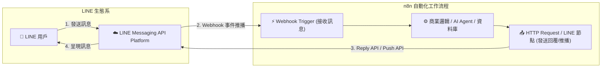
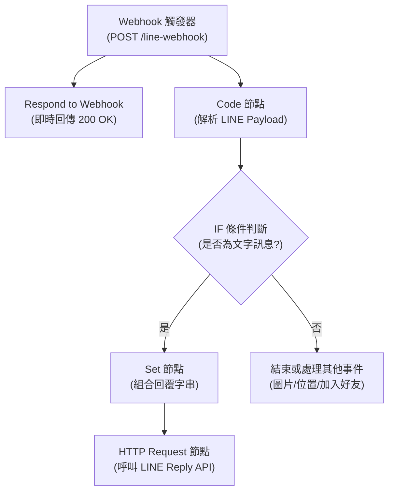

# 📱 LINE Messaging API 雙向整合實作

本章節介紹如何將 **LINE Messaging API** 與 **n8n 工作流程** 進行深度整合，實現「**接收 LINE 訊息觸發 n8n**」與「**n8n 呼叫 LINE 發送/回覆訊息**」的完整雙向通訊自動化。

---

## 🎯 整合核心目標



1. **目標一：LINE 訊息觸發 n8n 工作流程**
   - 用戶在 LINE 官方帳號傳送訊息時，LINE 伺服器即時透過 Webhook 將事件（JSON payload）推送到 n8n。
   - n8n 解析用戶 ID (`userId`)、訊息內容 (`text`)、回覆權杖 (`replyToken`) 等資訊，作為後續自動化或 AI 處理的輸入。

2. **目標二：n8n 節點呼叫 LINE Message 服務**
   - **被動回覆（Reply Message）**：使用 `replyToken` 在時效內（約 1 分鐘內）免費回覆用戶訊息。
   - **主動推播（Push Message）**：使用用戶的 `userId` 或群組 ID，在特定事件發生（如定時提醒、系統異常、訂單成立）時主動發送推播通知。

---

## 🛠️ 第一步：LINE Developers Console 前置設定

### 1. 建立 Messaging API Channel
1. 前往 [LINE Developers Console](https://developers.line.biz/) 並登入您的 LINE 帳號。
2. 建立或選擇一個 **Provider（提供者）**。
3. 點擊 **Create a new channel**，選擇 **Messaging API**。
4. 填寫必要資訊：
   - **Channel name**：機器人名稱（例如：`n8n 智能助理`）
   - **Channel description**：機器人簡介
   - **Category / Subcategory**：類別
5. 勾選同意條款並點擊 **Create** 建立頻道。

### 2. 取得 Channel Access Token（存取權杖）
1. 進入剛建立的 Messaging API 頻道設定頁面。
2. 切換至 **Messaging API** 分頁。
3. 滑動到最下方的 **Channel access token (long-lived)**。
4. 點擊 **Issue**（核發）產生一組長期存取權杖，並將此 Token 複製妥善保存。

### 3. 設定 LINE 官方帳號回應設定
1. 在 **Messaging API** 分頁中找到 **LINE Official Account features**。
2. 點擊 **Auto-reply messages** 旁的 **Edit**，會跳轉至 LINE Official Account Manager。
3. 在回應設定中進行調整：
   - **回應模式**：選擇「聊天機器人 (Bot)」
   - **自動回應訊息**：設定為「停用 (Disabled)」（避免 LINE 官方系統與 n8n 重複回覆）
   - **Webhook**：設定為「啟用 (Enabled)」

---

## 🔗 第二步：n8n Webhook 與 LINE Webhook URL 綁定

LINE 要求 Webhook 必須是公開且合法的 **HTTPS** 網址。

### 1. 本地開發環境（使用 ngrok）
若您的 n8n 運行在本地端（如 `localhost:5678`），請透過 ngrok 開啟公開通道：
```bash
ngrok http 5678
```
取得 HTTPS 網址（例如：`https://xxxx-xx-xx.ngrok-free.app`）。

### 2. 取得 n8n Webhook URL
在 n8n 工作流程中建立 **Webhook** 節點：
- **HTTP Method**：`POST`
- **Path**：`line-webhook`
- **Response Mode**：`Using 'Respond to Webhook' Node`（建議）或 `On Received`

> 📌 **Webhook URL 格式**：
> - **測試用 (Test URL)**：`https://<你的網域>/webhook-test/line-webhook`
> - **正式用 (Production URL)**：`https://<你的網域>/webhook/line-webhook`

### 3. 在 LINE Developers 設定 Webhook URL
1. 回到 LINE Developers 的 **Messaging API** 分頁。
2. 在 **Webhook URL** 欄位貼上 n8n 的 Webhook URL。
3. 開啟 **Use webhook** 開關。
4. 點擊 **Verify** 按鈕測試連線，若 n8n 正在監聽並回應 200，將顯示 `Success`。

---

## 🧩 第三步：n8n 工作流程實作解析

我們提供了開箱即用的工作流程範本：[`line_bot_workflow.json`](./line_bot_workflow.json)。

### 1. 工作流程節點架構



### 2. 重點節點設定說明

#### (1) Code 節點：解析 LINE Payload
LINE 的 Webhook 會包含 `events` 陣列，透過 JavaScript 提取關鍵欄位：
```javascript
const body = $input.first().json.body || {};
const events = body.events || [];

if (events.length === 0) {
  return [];
}

const event = events[0];
return [{
  json: {
    eventType: event.type,                  // 事件類型 (message, follow, unfollow...)
    messageType: event.message?.type || '', // 訊息類型 (text, image, sticker...)
    userMessage: event.message?.text || '', // 使用者輸入的文字
    replyToken: event.replyToken || '',     // 回覆用 Token
    userId: event.source?.userId || '',     // 使用者唯一識別碼
    timestamp: event.timestamp
  }
}];
```

#### (2) HTTP Request 節點：呼叫 LINE Reply API（回覆訊息）
- **Method**：`POST`
- **URL**：`https://api.line.me/v2/bot/message/reply`
- **Authentication**：`Generic Credential Type` -> `Header Auth` 或直接於 Headers 自訂
- **Headers**：
  - `Content-Type`: `application/json`
  - `Authorization`: `Bearer <你的 Channel Access Token>`
- **Body (JSON)**：
  ```json
  {
    "replyToken": "={{ $json.replyToken }}",
    "messages": [
      {
        "type": "text",
        "text": "={{ $json.replyText }}"
      }
    ]
  }
  ```

---

## 📢 第四步：主動推播訊息（Push Message）

當您需要在特定時間（如每日定時報表）或外部事件觸發（如監控警報、資料庫異動）時主動發訊息給使用者，可使用 LINE Push API。

### HTTP Request 節點設定：
- **Method**：`POST`
- **URL**：`https://api.line.me/v2/bot/message/push`
- **Headers**：
  - `Content-Type`: `application/json`
  - `Authorization`: `Bearer <你的 Channel Access Token>`
- **Body (JSON)**：
  ```json
  {
    "to": "U1234567890abcdef1234567890abcdef",
    "messages": [
      {
        "type": "text",
        "text": "🔔 [系統推播通知]\n今日伺服器備份已於 03:00 完成！"
      }
    ]
  }
  ```

> 💡 **如何取得用戶的 `userId`？**
> 當用戶第一次傳送訊息給機器人時，LINE Webhook payload 中的 `events[0].source.userId` 即為該用戶的固定 ID（格式為 `U` 開頭的 33 碼字串）。您可以透過 n8n 將其儲存至 Google Sheets、PostgreSQL 或 Notion 中備用。

### 💰 LINE 訊息費用與方案額度說明

LINE 官方帳號對於訊息計費的核心邏輯區分為 **Reply (回覆)** 與 **Push (主動推播)**：

1. **被動回覆（Reply API）— 完全免費無上限**：
   - 使用者發訊息進來，n8n 透過 `replyToken` 在 1 分鐘內回覆，**完全不佔用任何額度，也不收費**。
2. **主動推播（Push API / Multicast）— 依方案計費**：
   - 當 n8n 主動發送通知給特定用戶時，會扣除該官方帳號的每月訊息配額。
   - **LINE 官方帳號方案對照**：
     - **輕用量 (免費方案)**：月費 NT$0，每月提供 **200 則** 免費推播訊息（超過額度無法加購，當月無法再發送推播）。
     - **中用量**：月費 NT$800，每月提供 **3,000 則** 訊息（不可加購）。
     - **高用量**：月費 NT$1,200，每月提供 **6,000 則** 訊息（超過可加購，每則 NT$0.2 起）。

---

## 🤖 AI 賦能延伸實作（附 Prompt 提詞）

透過 n8n 的 **AI Agent** 節點與 LINE 串接，可將 LINE 機器人升級為具備記憶、知識庫查詢與工具調用能力的智能助理。

<details>
<summary>🤖 <strong>複製給 AI 助理的升級 Prompt</strong></summary>

```text
請幫我在目前的「LINE 雙向通訊工作流程」中加入 AI Agent 對話能力：
1. 保持原本的 LINE Webhook 觸發器與 Payload 解析。
2. 在「是否為文字訊息」成立後，將使用者的 userMessage 接入 AI Agent 節點。
3. 在 AI Agent 中配置：
   - 模型：OpenAI Chat Model (GPT-4o-mini) 或 Gemini Chat Model
   - 系統提示詞 (System Prompt)：「你是一個親切的 LINE 智能助手，請用繁體中文以簡潔清晰的語氣回覆使用者問題。」
   - 記憶組件：Window Buffer Memory（使用 userId 作為 Session Key 維持對話上下文）
4. 將 AI Agent 產生的回覆文字，透過 HTTP Request 呼叫 LINE Reply API 回傳給使用者。
請幫我建立相關節點與連線！
```
</details>

---

## ⚠️ 常見問題與排錯指南

| 問題現象 | 常見原因 | 解決方式 |
| :--- | :--- | :--- |
| **LINE Developers 點擊 Verify 顯示錯誤** | Webhook 未啟動或回傳非 200 狀態碼 | 確保 n8n 處於「Listen for test event」或 Workflow 已設為 **Active**，並確保有回傳 HTTP 200。 |
| **HTTP 401 Unauthorized** | Channel Access Token 錯誤或過期 | 檢查 Headers 中的 `Authorization` 是否為 `Bearer <TOKEN>`，並確認 Token 是否正確複製。 |
| **HTTP 400 Bad Request** | `replyToken` 失效或 JSON 格式錯誤 | `replyToken` 只能使用一次且時效極短（約 1 分鐘），請勿在同一次事件中重複呼叫 Reply API。 |
| **機器人會收到重複訊息** | LINE 伺服器在沒收到 200 回應時會自動重試 | 務必在工作流程中加入 `Respond to Webhook` 節點即時回傳 HTTP 200。 |
| **LINE 官方帳號重複回覆兩次** | 官方預設自動回應未關閉 | 請至 LINE Official Account Manager 回應設定中關閉「自動回應訊息」。 |

---

## 📚 相關資源

- [LINE Developers 官方文件 (Messaging API)](https://developers.line.biz/en/docs/messaging-api/)
- [LINE Messaging API Reference](https://developers.line.biz/en/reference/messaging-api/)
- [n8n Webhook 節點文件](https://docs.n8n.io/integrations/builtin/core-nodes/n8n-nodes-base.webhook/)
- [Telegram 整合實作教學](../Telegram/README.md)
