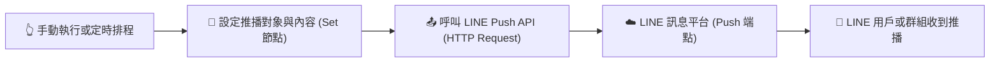

# LINE 整合實作
## 範例 2：n8n 節點呼叫 LINE Message 服務（主動推播）

### 📚 工作流程說明

這個 n8n 工作流程示範如何在外部事件發生（例如：手動執行、排程定時觸發、資料庫異動或系統警報）時，透過 **HTTP Request 節點** 搭配 **Header Auth 憑證**，主動呼叫 **LINE Push Message API** 發送推播訊息給指定的 LINE 使用者（User ID）或群組（Group ID）。

---

### 流程架構圖



---

### 工作流程樣版下載

- [📥 n8n 呼叫 LINE 發送推播訊息樣版 (line_push_message.json)](./line_push_message.json)

---

#### 📋 節點詳細說明

1. **📝 流程說明（Sticky Note）**
   - **功能**：畫布上的步驟摘要說明。

2. **👆 手動執行（Manual Trigger Node）**
   - **功能**：手動點擊「Test step」或「Execute Workflow」按鈕啟動流程。
   - **用途**：開發測試推播功能；正式環境可更換為 `Schedule Trigger`（定時排程）或外部 API 觸發器。

3. **📝 設定推播對象與內容（Edit Fields / Set Node）**
   - **功能**：定義推播的目標對象與訊息文字：
     - `targetUserId`：目標接收者的 LINE User ID（如 `U1234567890abcdef1234567890abcdef`）或群組 Group ID。
     - `pushMessage`：欲發送的推播文字，可使用 n8n 表達式（如 `{{ $now.format('yyyy-MM-dd HH:mm:ss') }}`）動態插入當前時間。

4. **📤 呼叫 LINE Push API（HTTP Request Node）**
   - **功能**：向 LINE Messaging API 官方端點發送 HTTP POST 請求。
   - **設定要點**：
     - **Method**：`POST`
     - **URL**：`https://api.line.me/v2/bot/message/push`
     - **Authentication**：選擇 `Predefined Credential Type` -> `Header Auth`（使用在 [LINE 設定指南](../../../line設定/README.md#步驟-4在-n8n-設定-header-auth-憑證與發送訊息) 中建立的 `Authorization` 憑證）。
     - **Send Body**：開啟並選擇 `JSON`
     - **JSON Body**：
       ```json
       {
         "to": "={{ $json.targetUserId }}",
         "messages": [
           {
             "type": "text",
             "text": "={{ $json.pushMessage }}"
           }
         ]
       }
       ```

---

#### 🎯 學習重點

- **Push Message 運作機制**：掌握如何使用 LINE User ID 主動向使用者或群組發送通知。
- **Header Auth 憑證綁定**：在 HTTP Request 節點中引用 `Authorization: Bearer <Channel Access Token>` 安全金鑰。
- **動態訊息組裝**：利用 n8n 的內建變數（如 `$now`、`$json`）動態組合通知內容。
- **LINE 官方訊息計費認知**：主動推播（Push API）會扣除官方帳號的免費則數（免費方案每月提供 200 則），與被動回覆（Reply API 免費）不同。

---

#### 💡 實際應用場景

- **系統監控與異常警報**：當伺服器 CPU 超載、API 斷線或資料庫異常時，立即推播至維運人員 LINE。
- **每日定時晨報 / 營運摘要**：每天早上 08:30 自動彙整前一日銷售額與待辦清單發送至團隊群組。
- **電商訂單與出貨通知**：當購物商城有新訂單成立時，自動發送物流通知給顧客。

---

#### ⚙️ 設定步驟

1. **確認前置憑證**：請確保已依照 **[📱 LINE 設定指南](../../../line設定/README.md)** 在 n8n 中建立了 `Header Auth` 憑證。
2. **取得目標用戶的 `userId`**：
   - 透過 [範例 1：LINE 訊息觸發工作流](../LINE訊息觸發工作流/README.md) 讓用戶先傳送一則訊息給官方帳號，即可從 n8n 的輸出資料中取得該用戶的 `userId`（以 `U` 開頭的 33 碼字串）。
3. **匯入工作流程**：在 n8n 介面點選 **Import from File** 匯入 [`line_push_message.json`](./line_push_message.json)。
4. **填入 User ID**：點開「設定推播對象與內容」節點，將 `targetUserId` 改為您的 LINE User ID。
5. **選擇憑證並執行**：
   - 點開「呼叫 LINE Push API」節點，確認 Credential 選擇了您的 Header Auth 帳號。
   - 點擊「Test step」或「Execute Workflow」，手機 LINE 即會立即收到推播通知！

---

<details>
<summary>🤖 <strong>AI 賦能延伸實作（附 Prompt 提詞）</strong></summary>

> 💡 **任務目標 1：透過 MCP 從零建立此推播工作流程**
> 複製下方 Prompt，AI 即可在您的 n8n 畫布上全自動建構出此工作流程。

**可直接複製給 AI 的 Prompt 提詞（建立推播工作流）**：
```text
請在我的 n8n 畫布上建立一個「n8n 呼叫 LINE Push API 主動推播訊息」工作流程：
1. 起點使用 Manual Trigger 節點（命名為「手動執行」）。
2. 接續連接 Edit Fields (Set) 節點（命名為「設定推播對象與內容」）：
   - targetUserId 設為 "U1234567890abcdef1234567890abcdef"
   - pushMessage 設為 "🔔【系統推播通知】\n您好！這是來自 n8n 自動化工作流程的主動推播訊息。\n目前時間：{{ $now.format('yyyy-MM-dd HH:mm:ss') }}"
3. 連接 HTTP Request 節點（命名為「呼叫 LINE Push API」）：
   - Method: POST
   - URL: https://api.line.me/v2/bot/message/push
   - Authentication: 選擇 Header Auth（使用已建立的 LINE Header Auth 憑證）
   - JSON Body 設為：
     {
       "to": "={{ $json.targetUserId }}",
       "messages": [
         {
           "type": "text",
           "text": "={{ $json.pushMessage }}"
         }
       ]
     }
請幫我建立所有節點、設定好欄位表達式並完成連線！
```

---

> 💡 **任務目標 2：結合外部 API + AI 總結的「每日晨間推播機器人」**
> 結合 Schedule 排程、外部 API 與 AI 模型，每天自動抓取名言或新聞並推播至 LINE。

**可直接複製給 AI 的 Prompt 提詞（每日晨報自動推播）**：
```text
請幫我把「LINE 推播工作流程」升級為「每日早上 08:30 AI 晨報推播機器人」：
1. 起點改為 Schedule Trigger 節點，設定為每天早上 08:30 觸發。
2. 串接 HTTP Request 節點，向 https://zenquotes.io/api/random 抓取今日隨機英文名言。
3. 串接 AI Agent（或 Basic LLM Chain）節點，搭配 Gemini 或 OpenAI Chat Model：
   - 提示詞設定：「請將傳入的英文名言翻譯為繁體中文，並附加一句 30 字以內的今日工作激勵小語，格式需排版美觀易讀。」
4. 最後串接 HTTP Request 節點，使用 Header Auth 憑證呼叫 LINE Push API，將 AI 產生的晨報內容推播給指定 targetUserId。
請直接幫我在畫布上建立並完成這套自動化流程！
```
</details>
