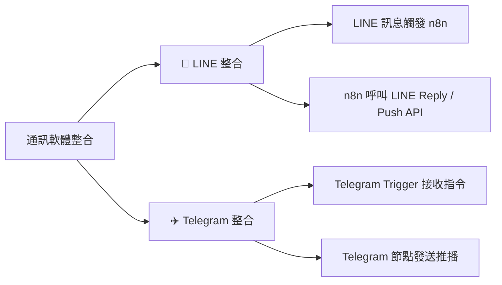

# 💬 通訊軟體整合實作（LINE & Telegram）

在企業與個人自動化場景中，即時通訊軟體（如 LINE 與 Telegram）是最常被用來進行**使用者互動**、**事件推播通知**與**AI 智能客服對話**的管道。

本章節介紹如何透過 n8n 實現與 LINE 及 Telegram 的雙向通訊自動化：
1. **觸發器（Inbound）**：當使用者在通訊軟體傳送訊息、點擊按鈕或傳送位置時，即時觸發 n8n 工作流程進行處理。
2. **服務呼叫與發送（Outbound）**：n8n 透過官方 API 或專屬節點發送即時回覆（Reply）、主動通知（Push）或富文本訊息（Flex Message / Markdown）。

---

## 🧭 子章節導覽

### 1. [📱 LINE Messaging API 雙向整合](./LINE/README.md)
* **核心功能**：
  - 使用 Webhook 節點接收 LINE 訊息事件（文字、貼圖、圖片、加入好友等）。
  - 解析 `replyToken` 與 `userId`。
  - 使用 HTTP Request 節點呼叫 LINE Reply API（免費即時回覆）與 Push API（主動推播）。
  - 整合 AI Agent 打造 7x24 LINE 智能客服。
* **附帶資源**：[`line_bot_workflow.json`](./LINE/line_bot_workflow.json)

---

### 2. [✈️ Telegram Bot 雙向整合](./Telegram/README.md)
* **核心功能**：
  - 使用 @BotFather 快速建立 Bot 並取得 API Token。
  - 使用 n8n 專屬 `Telegram Trigger` 接收群組與個人訊息、指令（如 `/start`）。
  - 使用 `Telegram` 節點發送富文本訊息、按鈕與推播通知。
  - 結合排程與監控系統實現全天候警報推播。
* **附帶資源**：[`telegram_bot_workflow.json`](./Telegram/telegram_bot_workflow.json)

---

## 📊 整合方案特性比較

| 特性 / 功能 | 📱 LINE Messaging API | ✈️ Telegram Bot API |
| :--- | :--- | :--- |
| **台灣/亞洲普及度** | ⭐⭐⭐⭐⭐ (極高) | ⭐⭐⭐ (中高) |
| **開發難易度** | 中等（需自行處理 Webhook Payload 與 Reply API） | 極簡易（n8n 內建專用 Trigger 與 Node） |
| **被動回覆 (Reply API)** | **完全免費且無上限**（使用 `replyToken` 在 1 分鐘內回覆，不計入訊息配額） | 完全免費且無上限 |
| **主動推播 (Push API)** | **輕用量方案每月提供 200 則免費**（超過需升級中/高用量月費方案） | **完全免費無則數上限** |
| **富文字與互動介面** | Flex Message (JSON 排版)、Rich Menu (圖文選單) | Inline Keyboard (行內按鈕)、Markdown/HTML 排版 |
| **主要適用場景** | 企業官方客服、行銷推廣、客戶預約、台灣在地服務 | 內部系統監控警報、個人自動化助理、技術社群互動 |

> 💡 **LINE 訊息計費重要觀念**：
> - **Reply API（回覆）**：當使用者先發訊息觸發 Webhook，n8n 拿 `replyToken` 回覆，**永遠免費且不限則數**！
> - **Push API（主動推播）**：系統主動發給用戶（如定時通知、警報），LINE 官方帳號免費「輕用量」方案每月提供 **200 則** 免費推播額度（超過無法加購，需升級中用量 NT$800/月 3,000則 或高用量 NT$1,200/月 6,000則）。

---

## 🚀 快速上手建議

- **如果您想打造面對客戶的官方客服或行銷自動化**：建議優先參考 [LINE 整合實作](./LINE/README.md)。
- **如果您想為自己或團隊打造免費、高頻率的伺服器監控與任務助理**：建議優先參考 [Telegram 整合實作](./Telegram/README.md)。
