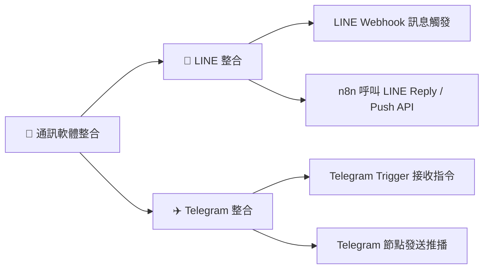

# 💬 通訊軟體整合實作（LINE & Telegram）

歡迎來到 n8n 通訊軟體整合教學！在企業營運與個人自動化場景中，即時通訊軟體（如 **LINE** 與 **Telegram**）是最常被用來進行**使用者互動**、**事件推播通知**與**AI 智慧助理對話**的核心管道。

本章節介紹如何透過 n8n 實現與 LINE 及 Telegram 的雙向通訊自動化：
1. **事件接收與觸發（Inbound）**：當使用者在通訊軟體傳送文字、指令或加入好友時，即時觸發 n8n 工作流程進行處理。
2. **訊息發送與推播（Outbound）**：n8n 透過官方 API 或專屬節點發送即時回覆（Reply）、主動通知（Push）或富文本排版訊息。

> 💡 **AI 協作時代學習法**：在完成基礎設定並透過 MCP 連線 AI 後，您可以直接複製各章節中的 **「AI 賦能延伸實作」** 折疊區塊（`
`）內的 Prompt 提詞，由 AI 助理替您在畫布上全自動建構與串接多管道通訊工作流！

---

## 🧭 通訊整合架構

---

## 📚 子章節與範例導覽

我們針對主流的 LINE 與 Telegram 提供系統化的教學與開箱即用的工作流程樣版：

---

### 1. [📱 LINE Messaging API 整合實作](./LINE/README.md)

提供從 LINE Developers 設定到三大實作範例的完整指南（另附 **[📱 圖文前置與憑證設定指南](../line設定/README.md)**）：

- **[範例 1：LINE 訊息觸發 n8n 工作流程](./LINE/LINE訊息觸發工作流/README.md)**
  - 使用 Webhook 節點接收訊息事件，即時回傳 200 OK，並精準解析 `userId`、文字內容與 `replyToken`。
  - 附帶樣版：[`line_webhook_trigger.json`](./LINE/LINE訊息觸發工作流/line_webhook_trigger.json)
- **[範例 2：n8n 節點呼叫 LINE Message 服務（主動推播）](./LINE/n8n呼叫LINE發送訊息/README.md)**
  - 手動或排程觸發，透過 Header Auth 憑證呼叫 LINE Push API 主動發送通知。
  - 附帶樣版：[`line_push_message.json`](./LINE/n8n呼叫LINE發送訊息/line_push_message.json)
- **[範例 3：LINE 雙向通訊與自動回覆（Bot 完整對話流程）](./LINE/LINE雙向通訊與自動回覆/README.md)**
  - 整合 Webhook 接收與 Reply API 免費回覆，建構完整的客服機器人閉環。
  - 附帶樣版：[`line_bot_workflow.json`](./LINE/LINE雙向通訊與自動回覆/line_bot_workflow.json)

---

### 2. [✈️ Telegram Bot 整合實作](./Telegram/README.md)

透過 Telegram 官方 `@BotFather` 快速建立機器人，利用 n8n 內建專屬節點輕鬆實現全自動推播與指令監聽：

- **Telegram Trigger 節點**：無需自行處理 Webhook 驗證，直接監聽聊天室訊息與 `/start` 等自訂指令。
- **Telegram 節點**：發送富文本 Markdown、行內按鈕（Inline Keyboard）與圖片警報。
- **完全免費無則數上限**：非常適合高頻率的伺服器監控與個人任務助理。
- 附帶樣版：[`telegram_bot_workflow.json`](./Telegram/telegram_bot_workflow.json)

---

## 📊 整合方案特性全面比較

| 評估項目 | 📱 LINE Messaging API | ✈️ Telegram Bot API |
| :--- | :--- | :--- |
| **台灣 / 亞洲普及度** | ⭐⭐⭐⭐⭐ (極高，台灣大眾必備) | ⭐⭐⭐ (技術社群、跨國團隊愛用) |
| **開發難易度** | 中等（需配置 Webhook URL 與 Header Auth） | 極簡易（n8n 內建專用 Trigger 與 Node） |
| **被動回覆 (Reply)** | **完全免費無上限**（使用 `replyToken` 在 1 分鐘內回覆） | **完全免費無上限** |
| **主動推播 (Push)** | 依官方方案額度計費（免費方案每月 **200 則**） | **完全免費無則數上限** |
| **排版與互動介面** | Flex Message (JSON 排版)、Rich Menu (圖文選單) | Inline Keyboard (按鈕)、Markdown / HTML |
| **最佳適用場景** | 企業官方客服、客戶預約、行銷推廣、在地化服務 | 內部系統監控、伺服器警報、個人自動化助理 |

---

## 💡 LINE 訊息計費重要觀念

在規劃 LINE 自動化時，請務必區分 **Reply (回覆)** 與 **Push (主動推播)** 的成本差異：

- **被動回覆（Reply API）— 永久免費無上限**：
  只要是由用戶主動在 LINE 發送訊息，n8n 透過 `replyToken` 在時效內（約 1 分鐘）進行回覆，**完全不佔用任何訊息額度，也不收費**。
- **主動推播（Push API）— 依方案扣抵**：
  當 n8n 在無使用者主動發訊的情況下（如定時排程、系統警報）主動發送訊息給用戶或群組，會扣除該官方帳號的每月免費額度（免費方案每月 200 則；中用量月費 NT$800 / 3,000 則；高用量月費 NT$1,200 / 6,000 則）。

---

## 🚀 快速選型與實作建議

- **若您的目標是「對外服務、客戶溝通或行銷自動化」**：
  👉 優先選擇 **[📱 LINE 整合實作](./LINE/README.md)**，並先參閱 **[LINE 設定指南](../line設定/README.md)** 完成前置憑證配置。
- **若您的目標是「內部維運、伺服器警報或個人高頻通知」**：
  👉 優先選擇 **[✈️ Telegram 整合實作](./Telegram/README.md)**，享有 0 成本、無推播則數限制的即時通知。
