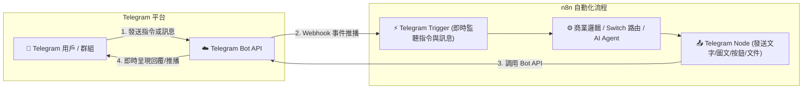

# ✈️ Telegram Bot 整合實作

歡迎來到 Telegram Bot 與 n8n 整合教學！Telegram 是當前自動化社群、技術團隊與個人開發者最喜愛的即時通訊平台。相較於其他通訊軟體，Telegram 具備**完全免費無推播則數上限**、**建立機器人極其迅速（透過 @BotFather）** 以及 **n8n 內建專屬 Trigger 與 Action 節點（無需手動配置 Webhook URL 與 HTTP Header Auth）** 等顯著優勢。

> 💡 **AI 協作時代學習法**：在完成基礎節點設定並透過 MCP 連線 AI（Gemini、ChatGPT 或 Claude）後，您可以直接複製各範例中的 **「AI 賦能延伸實作」** 折疊區塊（`<details>`）內的 Prompt 提詞，由 AI 助理替您在畫布上全自動建構與擴充進階邏輯！

---

## 🛠️ 前置設定指南

在開始建置工作流程前，僅需兩步即可完成 Telegram 機器人配置：

### 步驟 1：在 Telegram 建立 Bot 並取得 API Token
1. 在 Telegram 搜尋官方機器人管理員 **`@BotFather`** 並點擊 **Start**。
2. 輸入指令 `/newbot` 建立新的機器人。
3. 依序設定：
   - **Bot Name**（顯示名稱，例如：`My n8n Bot`）
   - **Bot Username**（唯一帳號，必須以 `bot` 結尾，例如：`my_n8n_helper_bot`）
4. 建立成功後，BotFather 會提供一組 **HTTP API Token**（格式例如：`1234567890:ABCdefGHIjklMNOpqrsTUVwxyz`），請妥善保存。

### 步驟 2：在 n8n 設定 Telegram API 憑證 (Credentials)
1. 開啟 n8n 介面，點選左側選單的 **Credentials** ➔ **Add Credential**。
2. 搜尋並選取 **Telegram API**。
3. 在 **Access Token** 欄位貼上剛才從 BotFather 取得的 Token。
4. 點擊 **Save**，確認連線測試成功。

### 步驟 3：取得個人或群組的 `Chat ID`
- **個人 Chat ID**：直接私訊您的 Bot 傳送 `/start`，透過「範例 1」的工作流程即可在輸出中取得 `message.chat.id`（正整數）。
- **群組 Chat ID**：將 Bot 邀請加入群組並給予發言權限，群組內發送任意訊息後，透過「範例 1」即可取得群組 `message.chat.id`（通常為 `-100` 開頭的負整數）。

---

## 🎯 整合核心架構



---

## 📚 實作範例導覽（由淺至深）

本教學規劃了五個循序漸進的實作範例，從單向觸發、主動推播、指令互動、多媒體檔案傳輸到結合 LLM 的 AI 智慧助理：

---

### 1. [範例 1：Telegram 訊息觸發 n8n 工作流程](./Telegram訊息觸發工作流/README.md)

學習如何使用 n8n 專屬的 **Telegram Trigger** 節點接收訊息，並自動解析發訊者資訊與對話內容。

**學習重點**：
- 使用 Telegram Trigger 節點自動註冊與接收訊息事件
- 解析 Telegram JSON 結構中的 `chatId`、`userName`、`userMessage`
- 使用 IF 條件節點過濾文字訊息
- 整理輸出結構化處理日誌

- **附帶樣版**：[`telegram_trigger_workflow.json`](./Telegram訊息觸發工作流/telegram_trigger_workflow.json)

<details>
<summary>🤖 <strong>AI 賦能延伸實作（附 Prompt 提詞）</strong></summary>

> 💡 **任務目標**：透過 MCP 連線，讓 AI 為 Telegram 訊息加入自動敏感詞過濾，並分類標記為一般提問或緊急請求。

**可直接複製給 AI 的 Prompt 提詞**：
```text
請在我的 n8n 畫布上從無到有建立一個「Telegram 訊息接收與關鍵字過濾分類」工作流程：
1. 起點使用 Telegram Trigger 節點（監聽 message 事件）。
2. 接續一個 Edit Fields (Set) 節點，提取 chatId, userName, userMessage。
3. 串接一個 IF 節點，判斷 userMessage 是否包含 "緊急" 或 "error" 或 "報修"。
4. 在 True 分支設定 priority: "HIGH"，並組合 logSummary: "🚨 收到來自 {{ $json.userName }} 的緊急訊息：{{ $json.userMessage }}"。
5. 在 False 分支設定 priority: "NORMAL"，並組合 logSummary: "ℹ️ 收到來自 {{ $json.userName }} 的一般訊息：{{ $json.userMessage }}"。
請幫我建立所有節點並完成連線！
```
</details>

---

### 2. [範例 2：n8n 節點發送 Telegram 訊息（主動推播與格式化通知）](./n8n呼叫Telegram發送訊息/README.md)

學習如何透過手動或排程觸發，使用 **Telegram 節點** 發送 Markdown 美化訊息並附加 **Inline Keyboard（行內按鈕）**。

**學習重點**：
- 手動 (Manual) 或排程 (Schedule) 觸發工作流程
- 透過 Telegram 節點發送富文本通知（支援 Markdown 語法）
- 設定 Inline Keyboard 行內互動超連結按鈕
- 掌握 0 成本、無額度上限的高頻主動推播

- **附帶樣版**：[`telegram_send_message.json`](./n8n呼叫Telegram發送訊息/telegram_send_message.json)

<details>
<summary>🤖 <strong>AI 賦能延伸實作（附 Prompt 提詞）</strong></summary>

> 💡 **任務目標**：透過 MCP 連線，讓 AI 建立每天早上 09:00 自動抓取天氣資訊並以 Markdown 美編推播至 Telegram 群組的排程流程。

**可直接複製給 AI 的 Prompt 提詞**：
```text
請幫我建立一個「每日早晨 09:00 台北天氣與穿著建議推播至 Telegram」工作流程：
1. 起點使用 Schedule Trigger 節點，設定為每天早上 09:00 執行。
2. 串接 HTTP Request 節點，呼叫開放天氣 API（或使用模擬天氣資料：溫度 22°C、降雨機率 40%、陰天）。
3. 串接 Edit Fields 節點，使用 Markdown 組織美觀排版：
   - 標題：🌤️ 今日台北天氣與出門建議
   - 指標：溫度、降雨機率、舒適度
   - 穿著建議：建議攜帶雨具並穿著薄外套
4. 最後串接 Telegram 節點，使用 Markdown 格式推播至 targetChatId，並附帶一個 Inline 按鈕連結至「中央氣象署網站」。
請幫我配置好所有表達式與節點連線！
```
</details>

---

### 3. [範例 3：Telegram 雙向通訊與指令自動回覆（Bot 完整對話流程）](./Telegram雙向通訊與自動回覆/README.md)

整合「**接收訊息 (Trigger)**」與「**多路指令分流 (Switch)**」，建構支援 `/start`、`/help`、`/info` 等斜線指令的互動式機器人。

**學習重點**：
- 完整對話閉環：接收 ➔ 提取 ➔ 指令分流 ➔ 對應回傳
- 使用 Switch 節點精準比對多組斜線指令（Slash Commands）
- 針對不同指令回覆客製化功能選單與系統狀態
- 為未定義的一般文字提供友善的 Fallback 引導回覆

- **附帶樣版**：[`telegram_bot_interactive.json`](./Telegram雙向通訊與自動回覆/telegram_bot_interactive.json)

<details>
<summary>🤖 <strong>AI 賦能延伸實作（附 Prompt 提詞）</strong></summary>

> 💡 **任務目標**：透過 MCP 連線，讓 AI 擴充客服常見問答指令（例如 `/price` 方案價格、`/faq` 常見問答）。

**可直接複製給 AI 的 Prompt 提詞**：
```text
請幫我擴充目前的「Telegram 雙向通訊工作流程」：
1. 在 Switch 節點中增加兩個新指令分支：
   - 指令一：`/price`（方案價格查詢），回傳包含「免費版：NT$0」、「專業版：NT$800」的 Markdown 價目表，並附上購買連結按鈕。
   - 指令二：`/faq`（常見問題），回傳前三大常見使用問題與說明。
2. 為這兩個分支各建立一個 Telegram 節點完成對應的訊息回覆。
3. 確保一般文字 Fallback 分支仍正常運作。
請幫我自動調整 Switch 規則並完成新節點的連線！
```
</details>

---

### 4. [範例 4：Telegram 發送照片與多媒體/文件檔案（圖文與報表自動推播）](./Telegram發送多媒體與文件/README.md)

學習如何使用 Telegram 節點發送圖片（Send Photo）、文件（Send Document，如 CSV、PDF、Excel），並附帶格式化 Caption 說明。

**學習重點**：
- Telegram 節點的 Photo 與 Document 模式操作
- 支援外部 URL 網址與 n8n 本地二進位資料（Binary Data）
- 為多媒體與檔案附加 Markdown 說明的 Caption 技巧
- 自動化報表與監控截圖推播整合

- **附帶樣版**：[`telegram_send_media.json`](./Telegram發送多媒體與文件/telegram_send_media.json)

<details>
<summary>🤖 <strong>AI 賦能延伸實作（附 Prompt 提詞）</strong></summary>

> 💡 **任務目標**：下載 CSV 轉成 Excel 後，將產出的 Excel 檔案直接透過 Telegram Document 節點發送給主管。

**可直接複製給 AI 的 Prompt 提詞**：
```text
請幫我建立一個「CSV 下載 ➔ 轉 Excel ➔ 自動傳送 Telegram 檔案」的工作流程：
1. 起點使用 Manual Trigger（或 Schedule Trigger）。
2. 串接 HTTP Request 節點下載 CSV 檔案（例如學生成績單 CSV）。
3. 串接 Extract from File 節點解析 CSV。
4. 串接 Convert to File 節點將資料轉換為 Excel (.xlsx) 檔案。
5. 最後串接 Telegram 節點，選擇 Resource: Document, Operation: Send Document，將產生的 Excel 檔案推播給 targetChatId，Caption 填入「📊 最新學生成績結算報表已生成，請查收！」。
請幫我建立並完成整套流程連線！
```
</details>

---

### 5. [範例 5：Telegram 整合 AI 智慧問答助理（含對話記憶）](./Telegram整合AI智慧助理/README.md)

將 Telegram 機器人升級為 AI 智慧大腦！串接大型語言模型（OpenAI / Gemini / Ollama）並以 `chatId` 實現多用戶記憶隔離。

**學習重點**：
- 整合 n8n 的 LangChain AI Agent 節點架構
- 串接大語言模型（OpenAI GPT-4o-mini / Google Gemini / 本機 Ollama）
- 使用 Window Buffer Memory 並以 `chatId` 作為 Session Key 實現獨立多輪對話歷史
- 設計繁體中文 System Message 人設提示詞

- **附帶樣版**：[`telegram_ai_agent.json`](./Telegram整合AI智慧助理/telegram_ai_agent.json)

<details>
<summary>🤖 <strong>AI 賦能延伸實作（附 Prompt 提詞）</strong></summary>

> 💡 **任務目標**：為 Telegram AI Agent 增添 Calculator 或 Wikipedia 等 Tool 工具調用能力，打造全能型多功能智慧助理。

**可直接複製給 AI 的 Prompt 提詞**：
```text
請幫我在目前的「Telegram AI 智慧問答助理」中擴充工具能力（Tools）：
1. 保持 Telegram Trigger 與 Window Buffer Memory 設定（以 chatId 為 Session Key）。
2. 在 AI Agent 節點下方掛載 Tool 工具節點：
   - 掛載 Calculator（計算機工具），讓 AI 具備精確數學運算能力。
   - 掛載 Wikipedia（或 Custom HTTP Tool）讓 AI 能即時查詢百科知識。
3. 調整 System Prompt：「你是一個具備工具使用能力的 Telegram 超級助理，若遇到數學運算或最新事實查詢，請主動調用工具獲取精準答案，並使用繁體中文親切回覆。」
4. 確保回答結果流暢回傳至 Telegram 節點。
請幫我配置好工具節點並完成連線！
```
</details>

---

## 💡 Telegram Bot 實用技巧與特色

### 1. 取得聊天室 ID（Chat ID）速查表

| 對象類型 | ID 格式特徵 | 取得方法 |
| :--- | :--- | :--- |
| **個人私聊 (Private)** | 正整數（如 `123456789`） | 私訊 Bot 傳送 `/start`，在 Telegram Trigger 輸出查看 `message.chat.id` |
| **一般/超級群組 (Group)** | 負整數（通常為 `-100` 開頭，如 `-1001234567890`） | 將 Bot 邀請入群並給予管理員/發言權限，群內發送訊息後在 Trigger 查看 |
| **公開頻道 (Channel)** | `@頻道名稱` 或 負整數 ID | 將 Bot 加入頻道為管理員（具發訊權限），Chat ID 可直接填 `@頻道名稱` |

---

### 2. Telegram Markdown 排版速查

Telegram 支援豐富的文字標記語法（需在 Telegram 節點勾選 `Parse Mode: Markdown`）：

```markdown
*粗體文字*
_斜體文字_
[超連結文字](https://n8n.io)
`單行程式碼/等寬字`
```整段代碼區塊```
```

---

## 📚 相關資源

- [n8n 官方 Telegram 節點文件](https://docs.n8n.io/integrations/builtin/app-nodes/n8n-nodes-base.telegram/)
- [Telegram Bot API 官方開發者文件](https://core.telegram.org/bots/api)
- [Telegram @BotFather 官方機器人入口](https://t.me/BotFather)
- [📱 LINE 整合實作教學](../LINE/README.md)
- [💬 通訊軟體整合總覽](../README.md)
