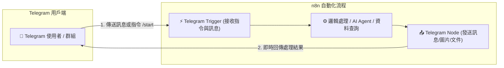
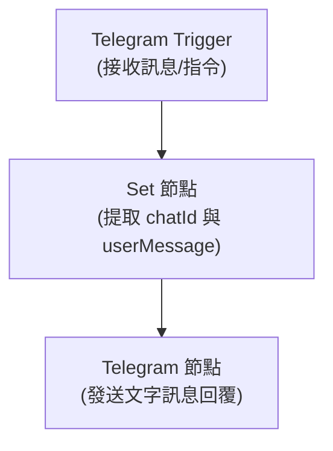

# ✈️ Telegram Bot 雙向整合實作

本章節介紹如何使用 n8n 內建的 **Telegram Trigger** 與 **Telegram Node**，快速建立能接收訊息並主動推播的 Telegram 智慧機器人。

---

## 🎯 整合核心目標



1. **目標一：Telegram 訊息觸發 n8n 工作流程**
   - 使用 n8n 專屬的 `Telegram Trigger` 節點，自動註冊 Telegram Webhook。
   - 當使用者在個人聊天室或群組傳送文字、圖片或指令時，即刻啟動工作流程。

2. **目標二：n8n 節點發送 Telegram 訊息與通知**
   - 透過 `Telegram` 節點，指定 `Chat ID` 即可傳送純文字、Markdown 格式訊息、按鈕（Inline Keyboard）或圖片/文件。
   - 支援主動推播（如定期發送每日日報、警報事件即時推播）。

---

## 🛠️ 第一步：在 Telegram 建立 Bot 並取得 API Token

Telegram 建立 Bot 非常簡單且快速：

1. 在 Telegram 搜尋官方的 `@BotFather` 並開始對話。
2. 輸入指令 `/newbot` 建立新的機器人。
3. 依序設定：
   - **Bot Name**（顯示名稱，例如：`My n8n Assistant`）
   - **Bot Username**（唯一使用者名稱，必須以 `bot` 結尾，例如：`my_n8n_helper_bot`）
4. 建立成功後，BotFather 會提供一組 **HTTP API Access Token**（格式例如：`1234567890:ABCdefGHIjklMNOpqrsTUVwxyz`），請妥善保存。

---

## 🔐 第二步：在 n8n 設定 Telegram 憑證 (Credentials)

1. 開啟 n8n 介面，點選左側選單的 **Credentials** -> **Add Credential**。
2. 搜尋並選擇 **Telegram API**。
3. 在 **Access Token** 欄位貼上剛才從 BotFather 取得的 Token。
4. 點擊 **Save** 完成儲存。

---

## 🧩 第三步：n8n 工作流程設計

我們提供了開箱即用的工作流程範本：[`telegram_bot_workflow.json`](./telegram_bot_workflow.json)。

### 1. 工作流程節點解析



#### (1) Telegram Trigger 節點
- **Credentials**：選擇已建立的 Telegram API 憑證。
- **Updates**：選擇 `message`（也可依需求勾選 `callback_query`、`inline_query` 等）。
- 啟動後，n8n 會自動呼叫 Telegram 的 `setWebhook` API 綁定端點。

#### (2) 提取關鍵資料
在收到訊息時，資料通常位於：
- **聊天室 ID**：`{{ $json.message.chat.id }}`
- **使用者訊息**：`{{ $json.message.text }}`
- **使用者暱稱**：`{{ $json.message.from.first_name }}`

#### (3) Telegram 節點（發送訊息）
- **Resource**：`Message`
- **Operation**：`Send Text`
- **Chat ID**：`={{ $json.chatId }}`
- **Text**：設定欲回傳的訊息內容，支援 Markdown 或 HTML 語法排版。

---

## 📢 第四步：主動推播通知與警報

若要在排程（Schedule Trigger）或發生警報時主動發送推播到特定聊天室或群組：

### 取得個人或群組的 `Chat ID`：
1. **個人 Chat ID**：在與您的 Bot 傳送訊息一次後，在 n8n 的 Telegram Trigger 輸出中即可查看 `message.chat.id`（正整數）。
2. **群組 Chat ID**：將 Bot 加入群組並設為管理員，群組內發送任意訊息後，Trigger 取得的 `message.chat.id`（通常為負數，如 `-1001234567890`）。

### 主動推播設定：
- 在任何工作流程（例如：監控 API 狀態的 Workflow）最後接上 **Telegram 節點**。
- 將 **Chat ID** 固定填入您的群組或個人 ID 即可實現 7x24 自動通知。

---

## 🤖 AI 賦能延伸實作（附 Prompt 提詞）

<details>
<summary>🤖 <strong>複製給 AI 助理的 Telegram AI 機器人升級 Prompt</strong></summary>

```text
請幫我在目前的「Telegram 雙向通訊工作流程」中加入 AI Agent 對話能力：
1. 保持 Telegram Trigger 節點作為入口。
2. 將使用者輸入的訊息 (message.text) 接到 AI Agent 節點。
3. 配置 AI Agent：
   - 模型選擇：OpenAI (GPT-4o-mini) 或 Claude / Gemini
   - System Prompt：「你是一個高效的 Telegram 智慧助理，請使用繁體中文回覆，格式簡潔易讀，可適度使用 emoji。」
   - 記憶組件：Window Buffer Memory（Session Key 設為 chatId）
4. 將 AI Agent 回傳的文字透過 Telegram 節點回傳至對應的 chatId。
請直接幫我配置這些節點！
```
</details>

---

## 📚 相關資源

- [n8n 官方 Telegram 節點文件](https://docs.n8n.io/integrations/builtin/app-nodes/n8n-nodes-base.telegram/)
- [Telegram Bot API 官方文件](https://core.telegram.org/bots/api)
- [LINE 整合實作教學](../LINE/README.md)
