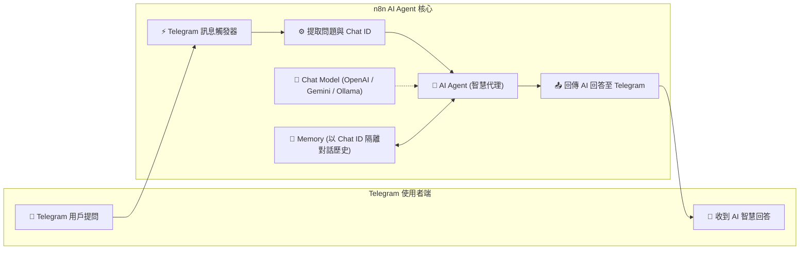
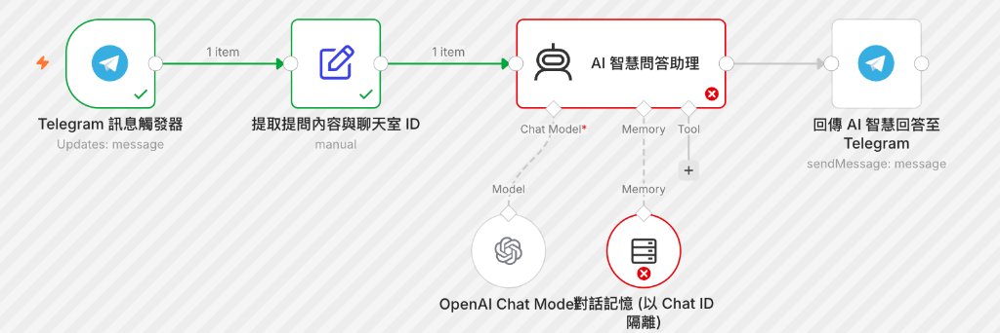

# Telegram 整合實作
## 範例 5：Telegram 整合 AI 智慧問答助理（含對話記憶）

### 📚 工作流程說明

這個 n8n 工作流程示範如何將 Telegram 機器人升級為具備上下文記憶能力的 **AI 智慧對話助理**。藉由將 **Telegram Trigger** 連接至 n8n 的 **AI Agent（智慧代理）**，並掛載大型語言模型（如 OpenAI GPT-4o-mini、Google Gemini 或本地 Ollama）與 **Window Buffer Memory（記憶組件）**，機器人能夠根據使用者的 `chatId` 獨立維持多輪對話歷史，提供貼心、精準且具連貫性的繁體中文問答服務。

---

### 流程架構圖

---

### 預覽圖

---

### 工作流程樣版下載

- [📥 Telegram 整合 AI 智慧助理樣版 (telegram_ai_agent.json)](./telegram_ai_agent.json)

---

#### 📋 節點詳細說明

1. **📝 流程說明（Sticky Note）**
   - **功能**：說明如何將 Telegram 訊息導入 AI Agent，並利用 Window Buffer Memory 實現多輪對話記憶。

2. **⚡ Telegram 訊息觸發器（Telegram Trigger Node）**
   - **功能**：即時接收來自私聊或群組的提問文字。

3. **⚙️ 提取提問內容與聊天室 ID（Edit Fields / Set Node）**
   - **功能**：準備傳遞給 AI Agent 的輸入參數：
     - `chatId`：用於識別用戶/群組聊天室。
     - `userName`：發問者的名稱。
     - `userMessage`：使用者傳送的提問文字。

4. **🤖 AI 智慧問答助理（AI Agent Node）**
   - **功能**：負責整合提示詞、對話記憶與 LLM 模型推論。
   - **設定要點**：
     - **Prompt Type**：`Define below`
     - **Text**：`=使用者名稱：{{ $json.userName }}\n使用者提問：{{ $json.userMessage }}`
     - **System Message**：設定 AI 角色人設，例如指定必須使用台灣繁體中文、語氣親切有禮、格式結構化。

5. **🧠 語言模型（OpenAI Chat Model / Gemini / Ollama）**
   - **功能**：提供大語言模型推論算力（預設配置 `gpt-4o-mini`，亦可無縫替換為 Google Gemini 或本地免費 Ollama 模型）。

6. **💾 對話記憶（Window Buffer Memory Node）**
   - **功能**：以使用者的 `chatId` 隔離儲存，自動維護最近 N 輪的對話歷史。
   - **核心設定**：
     - **Session ID Type**：選擇 `Custom Key`
     - **Session Key**：`={{ $json.chatId }}`（以 Telegram 聊天室 ID 進行記憶隔離）
     - **Context Window Length**：預設儲存最近 10 輪對話。

7. **📤 回傳 AI 智慧回答至 Telegram（Telegram Node）**
   - **功能**：將 AI 生成的文字內容（`{{ $json.output }}`）即時傳送回使用者的 Telegram 聊天室，支援 Markdown 語法排版。

---

#### 🎯 學習重點

- **LangChain AI Agent 節點串接**：掌握 n8n 高級 AI 節點架構與工作原理。
- **多用戶 Session Key 記憶隔離**：理解如何利用 `chatId` 實現多人同時使用機器人時各自保有專屬對話記憶。
- **靈活的模型切換**：學會根據成本與隱私考量，在 OpenAI、Gemini 與本機 Ollama 之間自由替換模型。
- **Prompt 人設工程**：掌握 System Message 規範語言風格、回答限制與輸出排版。

---

#### 💡 實際應用場景

- **24/7 全天候 Telegram AI 客服**：即時解答客戶諮詢、產品規格與售後服務問題。
- **個人隨身知識秘書**：隨時在 Telegram 詢問程式語法、文案翻譯、外文潤飾或閱讀摘要。
- **社群互動管理員**：將 Bot 加入 Telegram 群組，當群友發問時自動提供專業客觀的參考解答。

---

#### ⚙️ 設定步驟

1. **準備 LLM 憑證**：在 n8n **Credentials** 中建立 `OpenAI API`（或 `Google Gemini API` / `Ollama`）憑證。
2. **匯入工作流程**：下載並將 [`telegram_ai_agent.json`](./telegram_ai_agent.json) 匯入至 n8n。
3. **綁定憑證**：
   - 「Telegram 訊息觸發器」與最後的「回傳 Telegram 節點」選取 Telegram 憑證。
   - 「OpenAI Chat Model」節點選取已建立好的 OpenAI 憑證（或替換為 Gemini / Ollama 模型節點）。
4. **啟動工作流測試**：將工作流設為 **Active (Published)**，在 Telegram 發送連續性問題（例如：先問「我是誰？我叫小明」，再問「我剛剛說我叫什麼名字？」），驗證 AI 對話記憶與流暢回覆！
