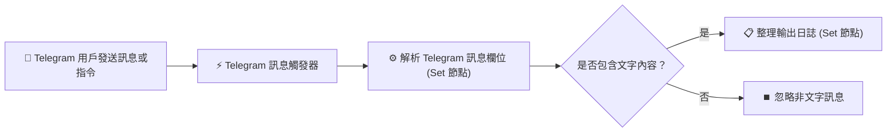

# Telegram 整合實作
## 範例 1：Telegram 訊息觸發 n8n 工作流程

### 📚 工作流程說明

這個 n8n 工作流程示範如何使用專屬的 **Telegram Trigger** 節點監聽 Telegram 機器人收到的訊息與指令。當使用者在 Telegram 個人私訊或群組中發送訊息時，工作流程將被即時觸發，並由後續的 **Edit Fields (Set)** 與 **IF** 節點自動解析提取關鍵資料（如 `chatId`、`userName`、`userMessage` 等），為資料庫記錄或自動化業務邏輯奠定基礎。

---

### 流程架構圖

---

### 工作流程樣版下載

- [📥 Telegram 訊息觸發工作流程樣版 (telegram_trigger_workflow.json)](./telegram_trigger_workflow.json)

---

#### 📋 節點詳細說明

1. **📝 流程說明（Sticky Note）**
   - **功能**：畫布上的便利貼，標記此範例的步驟與核心邏輯。

2. **⚡ Telegram 訊息觸發器（Telegram Trigger Node）**
   - **功能**：工作流程的起點，自動向 Telegram Bot API 註冊 Webhook 監聽事件。
   - **設定要點**：
     - **Credentials**：選擇已建立好的 `Telegram API` 憑證。
     - **Updates**：選擇 `message`（監聽一般訊息與文字指令）。

3. **⚙️ 解析 Telegram 訊息欄位（Edit Fields / Set Node）**
   - **功能**：從 Telegram 的 JSON 回傳結構中提取關鍵欄位：
     - `chatId`：`={{ $json.message.chat.id }}`（聊天室專屬識別碼，正整數為個人，負整數為群組/頻道）。
     - `chatType`：`={{ $json.message.chat.type }}`（例如 `private`、`group`、`supergroup`）。
     - `userId`：`={{ $json.message.from.id }}`（發訊者的個人 Telegram ID）。
     - `userName`：`={{ $json.message.from.first_name }}`（發訊者顯示名稱）。
     - `telegramUsername`：`={{ $json.message.from.username || '無' }}`（發訊者的 `@username` 帳號）。
     - `userMessage`：`={{ $json.message.text || '' }}`（傳送的文字內容）。
     - `messageTimestamp`：`={{ $json.message.date }}`（發送時間戳記）。

4. **🔀 是否包含文字內容？（IF Node）**
   - **功能**：判斷 `$json.userMessage` 是否非空（`notEmpty`），確保只有文字訊息進入主處理管線，避免語音、貼圖等造成字串處理異常。

5. **📋 整理輸出日誌（Edit Fields / Set Node）**
   - **功能**：將解析完成的資料組裝為結構化狀態摘要與處理時間，方便後續工作流程調用或寫入日誌庫。

---

#### 🎯 學習重點

- **自動 Webhook 註冊**：理解 Telegram Trigger 如何自動管理 Webhook，無需自行暴露或複製 Webhook 網址。
- **Telegram JSON 結構剖析**：掌握 Telegram Message 物件的階層關係（`message.chat` vs `message.from`）。
- **關鍵 Chat ID 取得**：理解個人私聊與群組聊天室在 ID 格式上的差異。
- **資料清洗與分流**：使用 Set 與 IF 節點完成安全可靠的訊息前處理。

---

#### 💡 實際應用場景

- **收集群組反饋**：監聽客服群組中用戶發送的提問與反饋，自動記錄至 Google Sheets 或 Notion。
- **維運指令監聽**：監聽特定管理員發送的維運指令（如 `/status`、`/restart`），啟動後續自動化運維流程。
- **用戶註冊與開通**：當新使用者在 Telegram 傳送訊息時，自動在內部系統建立用戶檔案。

---

#### ⚙️ 設定步驟

1. **取得 Telegram Bot Token**：在 Telegram 搜尋 `@BotFather` 輸入 `/newbot` 建立機器人並複製 API Token。
2. **在 n8n 建立憑證**：進入 n8n **Credentials** ➔ **Add Credential** ➔ 選擇 **Telegram API** 並貼上 Token。
3. **匯入工作流程**：下載並將 [`telegram_trigger_workflow.json`](./telegram_trigger_workflow.json) 匯入至 n8n。
4. **綁定憑證並啟用**：在「Telegram 訊息觸發器」節點選取您的 Telegram 憑證，並將工作流程切換為 **Active (Published)**。
5. **發送測試訊息**：在 Telegram 與您的機器人對話（傳送任意文字），回到 n8n 的 Executions 查看執行結果與解析出的欄位資料！
