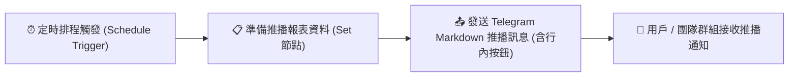

# Telegram 整合實作
## 範例 2：n8n 節點發送 Telegram 訊息（排程推播與格式化通知）

### 📚 工作流程說明

這個 n8n 工作流程示範如何透過 **Telegram 節點** 實現主動推播通知。工作流程可透過手動觸發（Manual Trigger）或定時排程（Schedule Trigger）啟動，將整理好的伺服器監控數據、維運日報或自訂提醒，以 **Markdown 富文本排版** 發送至指定的個人或群組聊天室，並整合 Telegram 特有的 **Inline Keyboard（行內超連結按鈕）**，大幅提升推播訊息的質感與互動體驗。

---

### 流程架構圖

---

### 工作流程樣版下載

- [📥 Telegram 發送訊息工作流程樣版 (telegram_send_message.json)](./telegram_send_message.json)

---

#### 📋 節點詳細說明

1. **📝 流程說明（Sticky Note）**
   - **功能**：說明排程觸發、資料準備與格式化推播的架構。

2. **⏰ 定時排程觸發器（Schedule Trigger Node）**
   - **功能**：定時啟動工作流程（例如：每天早上 08:30、每小時整點或每 5 分鐘檢測一次）。
   - **設定要點**：可依需求自訂執行間隔（Interval）或 Cron 表達式。

3. **📋 準備推播報表資料（Edit Fields / Set Node）**
   - **功能**：設定發送目標 `targetChatId` 與欲推播的各項指標數據：
     - `targetChatId`：接收通知的 Telegram Chat ID（填入個人 ID 或群組 ID 如 `-100xxxxxxx`）。
     - `serverName`、`serverStatus`、`cpuUsage`、`memoryUsage`、`diskUsage`、`alertLevel` 等。

4. **📤 發送 Telegram Markdown 推播訊息（Telegram Node）**
   - **功能**：呼叫 Telegram Bot API 的 `sendMessage` 方法發送格式化訊息。
   - **設定要點**：
     - **Resource**：`Message`
     - **Operation**：`Send Text`
     - **Chat ID**：`={{ $json.targetChatId }}`
     - **Text**：使用 Markdown 語法（例如 `*粗體*`、`_斜體_`、`` `行內代碼` ``）組織視覺排版。
     - **Additional Fields > Parse Mode**：選擇 `Markdown`（亦可選 `HTML`）。
     - **Additional Fields > Reply Markup > Inline Keyboard**：添加互動按鈕，設定按鈕文字與跳轉連結網址（URL）。

---

#### 🎯 學習重點

- **主動推播無則數限制**：體驗 Telegram 與 LINE 最大不同點（Telegram 推播完全免費且無額度上限）。
- **Markdown / HTML 排版語法**：掌握在 Telegram 中使用粗體、清單、等寬字型代碼區塊的美化技巧。
- **Inline Keyboard 互動按鈕**：學會配置附帶外部連結跳轉（URL Button）的行內按鈕。
- **群組與頻道廣播**：理解如何透過取得群組 Chat ID 將訊息廣播至整個團隊群組。

---

#### 💡 實際應用場景

- **伺服器健康監控警報**：每 5 分鐘自動檢測 API 或主機狀態，異常時立即推播至維運頻道。
- **電商每日營收日報**：每天午夜自動統計當日訂單總額與客單價，推播給主管團隊。
- **個人待辦與日曆提醒**：早上固定推播今日 Google Calendar 行程與重點待辦事項。

---

#### ⚙️ 設定步驟

1. **取得目標 Chat ID**：
   - **個人 Chat ID**：私訊您的機器人傳送 `/start`，透過範例 1 即可查看輸出中的 `chatId`（正整數）。
   - **群組 Chat ID**：將機器人邀請加入群組並給予發言權限，在群組發送任意文字，透過範例 1 即可取得群組 `chatId`（通常為 `-100` 開頭的負整數）。
2. **匯入工作流程**：下載並匯入 [`telegram_send_message.json`](./telegram_send_message.json)。
3. **填入 Chat ID 與綁定憑證**：
   - 在「準備推播報表資料」節點中，將 `targetChatId` 的值替換為您的實際 Chat ID。
   - 在「發送 Telegram Markdown 推播訊息」節點選取已配置好的 Telegram 憑證。
4. **測試執行**：點擊 **Test step** 或 **Execute workflow**，即可在 Telegram 立即收到排版精美的推播訊息與按鈕！
