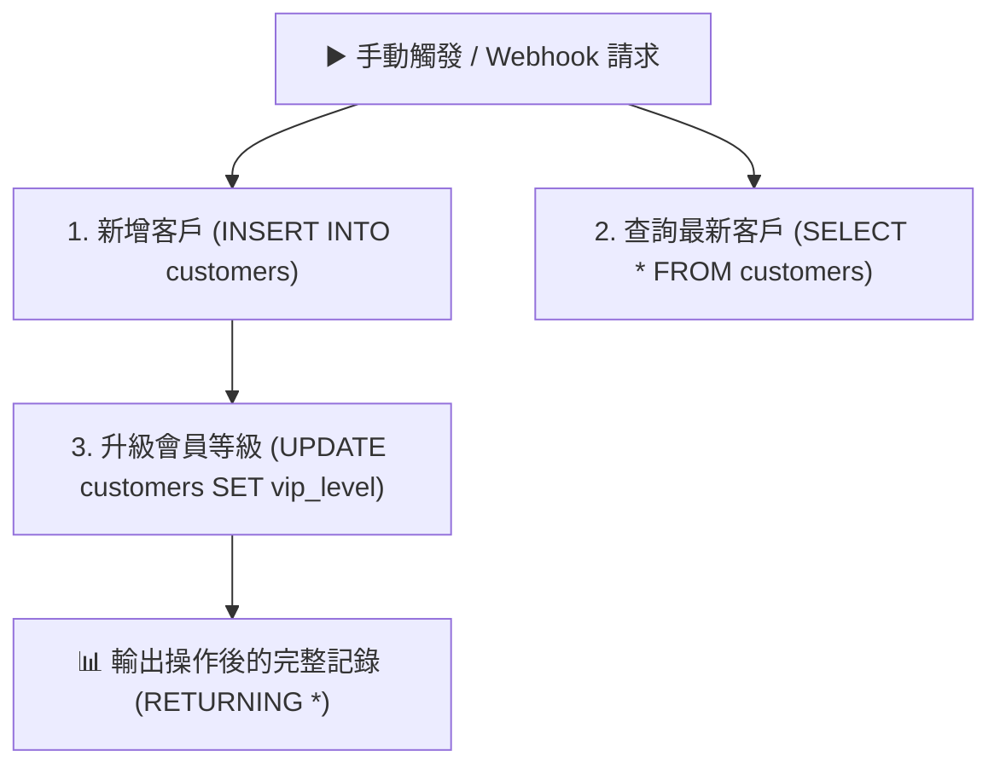

# 🗄️ 雲端資料庫整合
## 範例 1：Postgres 基礎 CRUD 與資料讀寫（SQL 增刪查改）

### 📚 工作流程說明

學習如何透過 n8n 的 **Postgres 節點** 連接 Supabase 或自建 PostgreSQL 資料庫，執行最基礎且重要的 **CRUD（Create 新增、Read 查詢、Update 修改、Delete 刪除）** 操作。本範例示範如何使用安全的參數化查詢（Parameterized Query `$1, $2, ...`）寫入客戶資料、查詢最新註冊名單，以及動態更新客戶的 VIP 等級。

---

### 流程架構圖



---

### 工作流程樣版下載

- [📥 Postgres 基礎 CRUD 工作流程樣版 (01_postgres_crud.json)](./01_postgres_crud.json)
- [📜 資料庫建表腳本 (schema.sql)](../Supabase/schema.sql)

---

#### 📋 節點詳細說明

1. **📝 流程說明（Sticky Note）**
   - **功能**：介紹 PostgreSQL 基礎 SQL 語法與防 SQL 注入參數化查詢的使用方式。

2. **▶️ 手動觸發測試（Manual Trigger）**
   - **功能**：點擊「Test step」即可啟動測試流程。

3. **1. 新增客戶 (INSERT INTO customers)**
   - **Operation**：`Execute a SQL Query`
   - **SQL 語句**：
     ```sql
     INSERT INTO public.customers (name, email, phone, vip_level)
     VALUES ($1, $2, $3, $4)
     RETURNING *;
     ```
   - **Query Parameters**：`['陳大明', 'ming_test@example.com', '0912-888-999', 'Gold']`
   - **重點**：使用 `$1, $2, $3` 代替字串拼接，能徹底防範 SQL 注入攻擊。

4. **2. 查詢最新客戶 (SELECT)**
   - **Operation**：`Execute a SQL Query`
   - **SQL 語句**：
     ```sql
     SELECT id, name, email, phone, vip_level, created_at
     FROM public.customers
     ORDER BY id DESC
     LIMIT 5;
     ```

5. **3. 升級 VIP 等級 (UPDATE)**
   - **Operation**：`Execute a SQL Query`
   - **SQL 語句**：
     ```sql
     UPDATE public.customers
     SET vip_level = 'Diamond', updated_at = NOW()
     WHERE email = 'ming_test@example.com'
     RETURNING *;
     ```

---

#### 🎯 學習重點

- **PostgreSQL 連線配置**：掌握 Host、Database、User、Password 與 SSL (Require) 的填寫。
- **參數化查詢安全觀念**：理解為什麼在生產環境嚴禁使用字串直接拼接 SQL。
- **`RETURNING *` 實用技巧**：PostgreSQL 支援在 `INSERT` / `UPDATE` / `DELETE` 之後直接返回影響的那一列資料，省去額外執行 `SELECT` 的往返時間。

---

<details>
<summary>🤖 <strong>AI 賦能延伸實作（附 Prompt 提詞）</strong></summary>

> 💡 **任務目標**：透過 MCP 連線，讓 AI 增加軟刪除（Soft Delete）機制與審計欄位。

**可直接複製給 AI 的 Prompt 提詞**：
```text
請幫我在目前的「Postgres 基礎 CRUD」工作流程中加入軟刪除（Soft Delete）邏輯：
1. 在資料庫中執行 ALTER TABLE public.customers ADD COLUMN IF NOT EXISTS is_deleted BOOLEAN DEFAULT false;
2. 新增一個 Postgres 節點：「軟刪除客戶」，執行 UPDATE public.customers SET is_deleted = true, updated_at = NOW() WHERE email = $1 RETURNING *;
3. 修改查詢節點，加入條件 WHERE is_deleted = false。
請幫我配置好 SQL 語句與節點連線！
```
</details>
