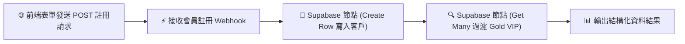

# 🗄️ 雲端資料庫整合
## 範例 2：Supabase Low-Code 節點與資料表自動化（免寫 SQL 快速存取）

### 📚 工作流程說明

如果不熟悉原生 SQL 語法，也可以使用 n8n 專屬的 **Supabase 節點**！透過 Supabase 提供的 REST API 介面，您只需在 n8n 視覺化下拉選單中挑選資料表名稱（Table Name）與欄位，就能輕鬆完成資料的新增、單筆/多筆條件過濾查詢、更新與刪除。

本範例展示：當外部透過 Webhook 傳送會員註冊表單時，Supabase 節點自動將資料新增至 `customers` 表，並自動檢索所有 `Gold` VIP 會員清單。

---

### 流程架構圖



---

### 工作流程樣版下載

- [📥 Supabase Low-Code 工作流程樣版 (02_supabase_lowcode.json)](./02_supabase_lowcode.json)
- [📜 資料庫建表腳本 (schema.sql)](../Supabase/schema.sql)

---

#### 📋 節點詳細說明

1. **📝 流程說明（Sticky Note）**
   - **功能**：介紹 Supabase API 憑證（Project URL 與 Anon / Service Role Key）與視覺化欄位對齊技巧。

2. **⚡ 接收會員註冊 Webhook（Webhook Node）**
   - **HTTP Method**：`POST`
   - **Path**：`register-customer`
   - **功能**：接收外部客戶端傳入的 `name`、`email`、`phone` 與 `vip_level`。

3. **📝 Supabase 寫入客戶（Supabase Node）**
   - **Resource**：`Row`
   - **Operation**：`Create`
   - **Table**：`customers`
   - **Fields to Send**：動態對應 `name`, `email`, `phone`, `vip_level`。

4. **🔍 Supabase 查詢 Gold VIP 清單（Supabase Node）**
   - **Resource**：`Row`
   - **Operation**：`Get Many`
   - **Table**：`customers`
   - **Filters**：設定 `vip_level eq Gold`，精準撈取目標群體。

---

#### 🧪 測試與驗證方法

使用 curl 發送一筆測試會員資料：

```bash
curl -X POST https://<你的n8n網址>/webhook/register-customer \
  -H "Content-Type: application/json" \
  -d '{
    "name": "林美麗",
    "email": "mary_test@example.com",
    "phone": "0911-222-333",
    "vip_level": "Gold"
  }'
```

打開 Supabase 網頁後台的 **Table Editor** ➔ `customers`，即可看見剛才新增的「林美麗」資料！

---

#### 🎯 學習重點

- **Postgres Node vs Supabase Node 差異**：
  - **Postgres 節點**：直接使用 SQL，效能極高，適合複雜關聯（JOIN）與進階運算。
  - **Supabase 節點**：使用 REST API，設定直覺無需懂 SQL，適合標準 CRUD 與快速原型開發。
- **Anon Key vs Service Role Key 權限**：
  - 一般查詢建議使用 `anon public key`（配合 RLS 安全策略）。
  - 後台系統自動化可使用 `service_role key` 繞過 RLS 限制。

---

<details>
<summary>🤖 <strong>AI 賦能延伸實作（附 Prompt 提詞）</strong></summary>

> 💡 **任務目標**：透過 MCP 連線，當新會員為 Gold 等級時，自動寄送尊榮迎賓 Email。

**可直接複製給 AI 的 Prompt 提詞**：
```text
請幫我在「Supabase Low-Code 節點」工作流程中加入條件通知：
1. 在「Supabase 寫入客戶」節點後，接續一個 IF 條件判斷。
2. 判斷條件：vip_level === "Gold"。
3. 在 True 分支連接 Gmail 節點，發送主題為「歡迎成為尊榮 Gold VIP 會員！」的專屬迎賓信。
請幫我建立相關節點與連線！
```
</details>
