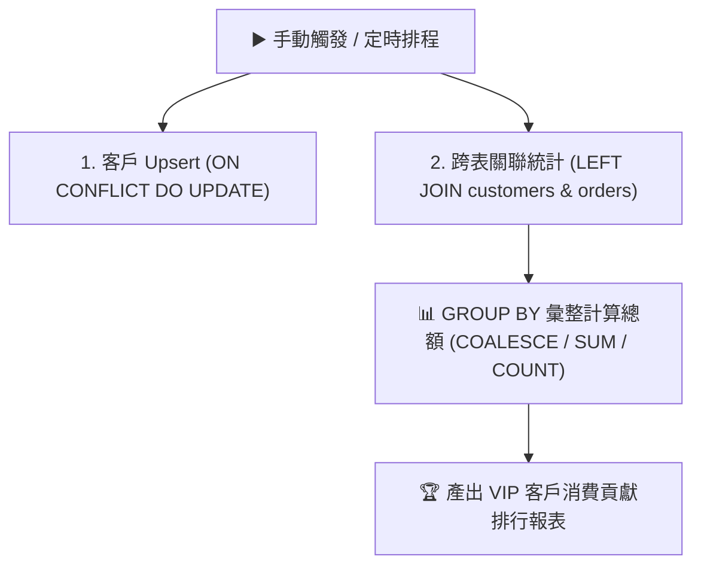

# 🗄️ 雲端資料庫整合
## 範例 3：電商訂單 Upsert 與跨表關聯統計報表（防重複與大數據聚合）

### 📚 工作流程說明

在企業資料自動化中，最常見的兩個痛點是：
1. **防止重複寫入（Idempotency / Upsert）**：當客戶多次下單或更新資料時，系統必須能自動識別（例如依據 `email` 唯一鍵），存在時更新、不存在時新增。
2. **跨資料表統計分析（JOIN & Aggregate）**：將 `customers`（客戶表）與 `orders`（訂單表）進行關聯，計算每位會員的「累積訂單數」與「歷史消費總金額」，並依貢獻度降冪排序。

本範例透過 PostgreSQL 的 `ON CONFLICT DO UPDATE` 與 `LEFT JOIN ... GROUP BY` 語法，在 n8n 中一鍵完成高階商業資料庫運算。

---

### 流程架構圖



---

### 工作流程樣版下載

- [📥 電商訂單 Upsert 與跨表關聯統計工作流程樣版 (03_ecommerce_upsert_analytics.json)](./03_ecommerce_upsert_analytics.json)
- [📜 資料庫建表腳本 (schema.sql)](../Supabase/schema.sql)

---

#### 📋 節點詳細說明

1. **📝 流程說明（Sticky Note）**
   - **功能**：介紹 `ON CONFLICT` 語法與 `LEFT JOIN` 的進階資料庫彙整應用。

2. **1. Upsert 客戶 (ON CONFLICT)**
   - **Operation**：`Execute a SQL Query`
   - **SQL 語句**：
     ```sql
     INSERT INTO public.customers (name, email, phone, vip_level)
     VALUES ($1, $2, $3, $4)
     ON CONFLICT (email) 
     DO UPDATE SET 
         phone = EXCLUDED.phone,
         vip_level = EXCLUDED.vip_level,
         updated_at = NOW()
     RETURNING *;
     ```
   - **核心技巧**：使用 `EXCLUDED` 關鍵字取得原本嘗試寫入的新值，若衝突則動態覆蓋舊值。

3. **2. 跨表統計報表 (JOIN & GROUP BY)**
   - **Operation**：`Execute a SQL Query`
   - **SQL 語句**：
     ```sql
     SELECT 
         c.id AS customer_id,
         c.name AS customer_name,
         c.email,
         c.vip_level,
         COUNT(o.id) AS total_orders,
         COALESCE(SUM(o.total_amount), 0.00) AS total_spent_amount
     FROM public.customers c
     LEFT JOIN public.orders o ON c.id = o.customer_id
     GROUP BY c.id, c.name, c.email, c.vip_level
     ORDER BY total_spent_amount DESC;
     ```
   - **核心技巧**：使用 `COALESCE` 處理無訂單客戶的 `NULL` 值，預設補 `0.00`。

---

#### 🎯 學習重點

- **Upsert 的商業價值**：避免傳統「先 SELECT 檢查是否存在，再判斷執行 INSERT 還是 UPDATE」的兩次往返與 Race Condition（競爭條件）。
- **關聯式資料庫分析力**：善用資料庫引擎原生的聚合效能，而非將數萬筆原始資料拉進 n8n 記憶體中用 JavaScript 迴圈計算。

---

<details>
<summary>🤖 <strong>AI 賦能延伸實作（附 Prompt 提詞）</strong></summary>

> 💡 **任務目標**：透過 MCP 連線，讓 AI 將統計報表自動轉為 Markdown 表格並發送至 Telegram。

**可直接複製給 AI 的 Prompt 提詞**：
```text
請幫我在「電商訂單 Upsert 與跨表統計」工作流程後方加入自動報表發送：
1. 取得跨表統計結果後，串接一個 Code 節點，將資料轉換為 Markdown 表格字串（包含：排名、客戶姓名、VIP等級、訂單數、總金額）。
2. 串接 Telegram 節點，發送主題為「📊 本週 VIP 客戶消費貢獻排行」的即時推播。
請幫我配置好程式碼與節點連線！
```
</details>
