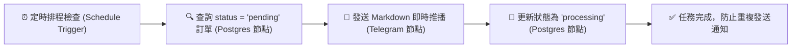

# 🗄️ 雲端資料庫整合
## 範例 4：資料庫變更即時偵測與 Telegram/LINE 告警推播（狀態監控與通知閉環）

### 📚 工作流程說明

在自動化營運中，經常需要對資料庫中的狀態變更做出即時反應（例如：電商收到新訂單、工單狀態被標記為緊急、伺服器錯誤紀錄等）。

本範例展示：透過 **Schedule Trigger（定時輪詢）** 或外部 Webhook 監控 Supabase 中的 `orders` 資料表：
1. 自動撈取所有 `status = 'pending'` 的新進未處理訂單。
2. 串接客戶資料表，取得客戶姓名與電話。
3. 透過 **Telegram 節點** 發送美觀的 Markdown 富文本即時通知給營運團隊。
4. 通知發送成功後，自動執行 SQL 將該筆訂單狀態更新為 `processing`，形成防重複通知的完美閉環！

---

### 流程架構圖



---

### 工作流程樣版下載

- [📥 資料庫變更即時偵測與推播工作流程樣版 (04_db_trigger_notification.json)](./04_db_trigger_notification.json)
- [📜 資料庫建表腳本 (schema.sql)](../Supabase/schema.sql)

---

#### 📋 節點詳細說明

1. **⏰ 每分鐘檢查新訂單（Schedule Trigger）**
   - **Trigger interval**：每 1 分鐘執行一次（可依需求調整）。

2. **1. 查詢 pending 待處理訂單（Postgres Node）**
   - **Operation**：`Execute a SQL Query`
   - **SQL 語句**：
     ```sql
     SELECT o.id, o.order_number, o.total_amount, o.status, c.name AS customer_name, c.phone
     FROM public.orders o
     JOIN public.customers c ON o.customer_id = c.id
     WHERE o.status = 'pending'
     LIMIT 10;
     ```

3. **2. Telegram 發送新訂單推播（Telegram Node）**
   - **Chat ID**：填入您的 Telegram 個人或管理員群組 Chat ID。
   - **Text 範本**：
     ```markdown
     🔔 *【新訂單即時通知】*
     ━━━━━━━━━━━━━━
     📦 *訂單編號*：`{{ $json.order_number }}`
     👤 *訂購客戶*：{{ $json.customer_name }} ({{ $json.phone }})
     💰 *應付金額*：*${{ $json.total_amount }}*
     🕒 *偵測時間*：{{ $now.format('yyyy-MM-dd HH:mm:ss') }}
     ━━━━━━━━━━━━━━
     系統已自動切換為處理中狀態！
     ```
   - **Parse Mode**：`Markdown`

4. **3. 更新狀態為 processing（Postgres Node）**
   - **Operation**：`Execute a SQL Query`
   - **SQL 語句**：
     ```sql
     UPDATE public.orders
     SET status = 'processing'
     WHERE id = $1
     RETURNING id, order_number, status;
     ```
   - **Query Parameters**：`={{ $json.id }}`

---

#### 🎯 學習重點

- **狀態機閉環設計 (State Machine Loop)**：掌握「讀取 Pending ➔ 執行通知 ➔ 標記 Processing」的標準企業工單處理三部曲。
- **異步通知與通訊軟體整合**：理解如何將底層資料庫事件即時推播至前端通訊管道（Telegram / LINE）。

---

<details>
<summary>🤖 <strong>AI 賦能延伸實作（附 Prompt 提詞）</strong></summary>

> 💡 **任務目標**：透過 MCP 連線，當訂單金額超過 5,000 元時，額外發送高單價大額訂單特急警報。

**可直接複製給 AI 的 Prompt 提詞**：
```text
請幫我在「資料庫變更偵測」流程中加入大額訂單分流：
1. 在查詢出 pending 訂單後，串接 IF 節點判斷 total_amount >= 5000。
2. 若為 True，發送帶有 🚨 符號的「VIP 大額特急訂單」推播給主管群組。
3. 若為 False，發送一般 Telegram 訂單通知。
4. 兩條分支最後皆匯流至更新狀態為 processing 節點。
請幫我配置好 IF 條件與分支連線！
```
</details>
