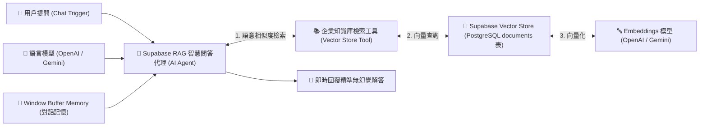

# 🗄️ 雲端資料庫整合
## 範例 5：Supabase pgvector 向量知識庫與 AI 語意搜尋（PostgreSQL 變身 AI 大腦）

### 📚 工作流程說明

誰說 AI 知識庫一定要額外付費購買專用的向量資料庫（如 Pinecone 或 Milvus）？

在 Supabase（PostgreSQL）中，您只需執行 `CREATE EXTENSION vector;` 啟用 **`pgvector`** 擴充套件，PostgreSQL 就能直接儲存高維度文字向量（Embeddings）並進行餘弦相似度（Cosine Distance `<=>`）語意比對！

本範例展示：
1. 在 Supabase 建立具備 1536 維向量欄位的 `documents` 表與 `match_documents` 檢索函數。
2. 透過 n8n 的 **Supabase Vector Store** 節點連接資料庫。
3. 結合 **AI Agent** 與 **OpenAI / Gemini Embeddings**，實現零幻覺、精準依據企業私有規章回答問題的智慧客服系統。

---

### 流程架構圖



---

### 工作流程樣版下載

- [📥 Supabase pgvector 向量知識庫工作流程樣版 (05_supabase_pgvector_rag.json)](./05_supabase_pgvector_rag.json)
- [📜 資料庫建表與向量搜尋腳本 (schema.sql)](../Supabase/schema.sql)

---

#### 📋 節點詳細說明

1. **📝 流程說明（Sticky Note）**
   - **功能**：介紹 pgvector 擴充套件、餘弦距離計算原理與 RAG 檢索流程。

2. **💬 When chat message received（Chat Trigger）**
   - **功能**：提供內建的測試對話視窗。

3. **🤖 Supabase RAG 智慧問答代理（AI Agent Node）**
   - **功能**：調用語言模型進行推理，自主調用向量檢索工具獲取私有文檔。

4. **📚 企業知識庫檢索工具（Vector Store Tool）**
   - **功能**：將 Supabase Vector Store 包裝為可供 AI 代理調用的 Tool。

5. **🐘 Supabase Vector Store 節點**
   - **Table Name**：`documents`
   - **功能**：透過 Supabase API 調用 `match_documents` 函數執行向量餘弦比對。

6. **🔤 Embeddings OpenAI 節點**
   - **Model**：`text-embedding-3-small` (1536 維度)

---

#### 🧪 測試與驗證方法

在 Supabase SQL Editor 執行以下 SQL 插入一筆測試知識庫：

```sql
INSERT INTO public.documents (content, metadata)
VALUES 
('本公司企業方案費用為每月 3,000 元，提供 7x24 小時專屬技術支援與無限次自動化工作流程執行。', '{"topic": "pricing"}');
```

在 n8n 聊天視窗詢問：「請問企業方案多少錢？有什麼支援？」，AI 將精準回答 `3,000 元` 與 `7x24 小時專屬技術支援`，證明已成功檢索 Supabase 向量資料！

---

#### 🎯 學習重點

- **一庫多用（All-in-One Database）**：一家企業只需維護一套 PostgreSQL，即可同時管理客戶關聯資料、訂單交易日誌與 AI 向量知識庫。
- **維度匹配觀念**：`schema.sql` 中的 `VECTOR(1536)` 必須與所選用的 Embedding 模型維度（如 OpenAI 1536 維、Gemini 768 維）嚴格相符。

---

<details>
<summary>🤖 <strong>AI 賦能延伸實作（附 Prompt 提詞）</strong></summary>

> 💡 **任務目標**：透過 MCP 連線，讓 AI 增加來源 Metadata 過濾（例如只搜尋 `category: "hr"` 的員工手冊）。

**可直接複製給 AI 的 Prompt 提詞**：
```text
請幫我在「Supabase pgvector」流程中加入 Metadata 過濾機制：
1. 修改 match_documents 呼叫設定，傳入 filter 條件：{"category": "hr"}。
2. 讓 AI Agent 僅能在人力資源規章範圍內檢索請假與出勤相關政策。
請幫我配置好檢索工具的過濾參數！
```
</details>
