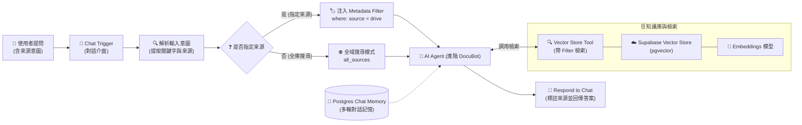

# 🗄️ 雲端資料庫整合
## 範例 6：RAG 檢索策略與 Metadata 來源過濾（精準語意搜尋）

### 📚 工作流程說明

在真實企業 RAG 應用中，單靠「向量語意相似度」往往會面臨**跨部門文件混淆、歷史舊版本干擾**等問題。

本範例展示高階的 **RAG 檢索策略（Retrieval Strategies）—— Metadata Filtering（元資料過濾）**：
1. **智能意圖與來源辨識**：使用者可直接以自然語言提問（例如：「從 Google Drive 查詢...」或「從本機檔案中找...」），系統自動偵測並提取目標資料來源。
2. **動態 Metadata 過濾注入**：依據使用者意圖動態建構 PostgreSQL / Supabase 的 JSONB 篩選條件（`where: { "source": { "$eq": "google_drive" } }`），大幅提升檢索精準度。
3. **無縫全庫搜尋退避（Fallback）**：若未指定來源，自動搜尋全量知識庫，兼具靈活性與精確性。
4. **多輪對話記憶（Postgres Memory）**：整合對話歷史記憶，支援多輪上下文連貫問答。

> 🤖 **模型註冊與串接指南（推薦資安合規主軸）**：
> - [**NVIDIA NIM 微服務模型串接**](../../../nvidia_nim/README.md)（免費取得 API Key，使用 `meta/llama-3.3-70b-instruct`）
> - [**OpenRouter 多模型聚合平台**](../../../openrouter/README.md)（單一 Key 調用多種主流合規模型）

---

## 🧭 工作流程架構



---

## 📥 工作流程圖下載

- [下載範例流程：RAG_進階檢索_來源過濾.json](./RAG_進階檢索_來源過濾.json)

---

## 📋 節點詳細說明

### 1. 💬 Chat Trigger（對話觸發器）
- **功能**：接收使用者輸入（`$json.chatInput`）。
- **副標題提示**：明確引導使用者「直接提問可搜尋全部；輸入『從本機...』或『從 Google Drive...』可指定範圍」。

### 2. 🔍 解析使用者輸入（Edit Fields / Set）
- **功能**：透過 JavaScript Expression 進行自然語言關鍵字匹配：
  - `source_filter`：偵測包含「本機/本地/上傳」➔ 標記為 `local_upload`；包含「Google/Drive/雲端」➔ 標記為 `google_drive`；其餘標記為 `all`。
  - `clean_question`：自動剔除提問中的贅字（如「幫我找、從雲端查詢」），保留核心語意進行 Embedding 計算。

### 3. ❓ 是否需要過濾來源（IF 條件節點）
- **邏輯**：判斷 `source_filter !== 'all'`。
  - **True**：流向特定來源過濾分支。
  - **False**：流向全庫檢索分支。

### 4. 🏷️ 設定過濾配置（Edit Fields / Set）
- **動態 JSON 結構**：
  ```json
  {
    "where": {
      "source": {
        "$eq": "google_drive"
      }
    }
  }
  ```
- 此結構將作為檢索參數動態傳入向量資料庫。

### 5. 🤖 AI Agent (Tools Agent)
- **功能**：具備工具調用能力的進階助理，能根據使用者是否指定來源，以最精準的過濾範圍檢索向量庫。

### 6. 💾 Postgres Chat Memory
- **功能**：將對話歷史儲存於 PostgreSQL / Supabase 資料庫，支援跨輪次上下文記憶。

---

## 🎯 學習重點

1. **Metadata 結構化過濾**：理解在向量資料庫中透過 Metadata 進行精準前置/後置過濾（Pre/Post-Filtering）的重要性。
2. **提示詞與意圖解析**：掌握在 n8n 中結合正則表達式與條件分支進行自然語言意圖分流的實用技巧。
3. **對話狀態持久化**：理解外部持久化 Memory（Postgres）與 In-Memory 的差異與生產環境優勢。

---

## 🤖 AI 賦能延伸實作

<details>
<summary>💡 <strong>AI 賦能延伸實作（可直接複製給 AI 的 Prompt 提詞）</strong></summary>

> **任務目標**：透過 MCP 連線，讓 AI 助理為此工作流擴充「時間區間過濾（Date Range Filtering）」與「文件機密等級（Security Level）」雙重過濾功能。

**可直接複製給 AI 的 Prompt 提詞**：
```text
請幫我在目前的 n8n 畫布上，延伸「RAG 進階檢索策略」工作流程：
1. 在「解析使用者輸入」節點中，新增解析「時間關鍵字」（例如：2024年、上個月）與「機密等級」（例如：內部公開、機密）。
2. 在 filter_config 結構中，支援多條件複合過濾：
   - { "where": { "$and": [{ "source": "google_drive" }, { "year": 2024 }] } }
3. 調整 AI Agent 的 System Prompt，若使用者權限不足以讀取機密文件，自動於回覆中說明無存取權限。
請幫我調整節點表達式與連線。
```
</details>

---

[⬅️ 返回範例 5：Supabase pgvector 向量知識庫](../05_Supabase_pgvector向量知識庫/README.md) ｜ [➡️ 前往範例 7：Pinecone 雲端向量資料庫與 AI 檢索](../07_Pinecone雲端向量資料庫與AI檢索/README.md) ｜ [🏠 返回資料庫總目錄](../README.md)
