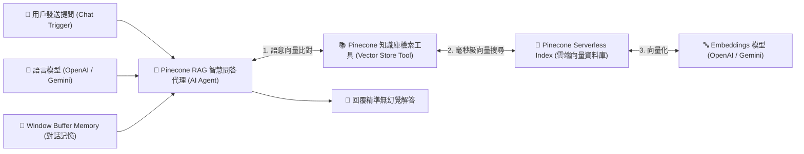

# 🗄️ 雲端資料庫整合
## 範例 7：Pinecone 雲端向量資料庫與 AI 檢索（免費 Serverless 向量資料庫）

> 💡 **零成本上手指南（完全不用錢）**  
> **Pinecone** 提供永久免費的 **Starter Plan（Serverless 方案）**，支援建立 1 個向量索引、內含 2GB 儲存空間與每月免費查詢額度，**註冊完全無需輸入信用卡**，是學習專屬向量資料庫的首選！

---

### 📚 工作流程說明

這個工作流程示範如何將 **專用雲端向量資料庫 Pinecone** 整合到 n8n 中，打造高精準度的 **RAG（檢索增強生成）智慧問答助理**：
1. **向量儲存**：將企業文件、商品規格或技術手冊切塊後，透過 Embeddings 模型轉換為高維向量並存入 Pinecone。
2. **毫秒級語意檢索**：當使用者在聊天室提問時，n8n 透過 Pinecone 快速進行餘弦相似度比對，找出關聯度最高的知識片段。
3. **無幻覺解答**：AI Agent 結合檢索到的專屬知識庫，即時給予精確且客製化的繁體中文回答。

---

### 流程架構圖



---

### 工作流程樣版下載

- [📥 Pinecone 雲端向量資料庫工作流程樣版 (06_pinecone_vector_rag.json)](./06_pinecone_vector_rag.json)

---

## 🆓 如何免費建立 Pinecone（不用花錢步驟指南）

只需 3 分鐘即可完成 Pinecone 免費帳號與 Serverless 索引設定：

### 步驟 1：註冊 Pinecone 免費帳號（免信用卡）
1. 前往 [Pinecone 官方網站 (pinecone.io)](https://www.pinecone.io/)。
2. 點擊右上角 **Sign Up Free**，使用您的 Google 或 GitHub 帳號快速登入。
3. 系統會自動指派為永久免費的 **Starter Plan**（無需填寫任何付款資訊）。

### 步驟 2：建立免費 Serverless 向量索引 (Index)
1. 進入 Pinecone 控制台，點選 **Create Index**。
2. 填寫以下設定：
   - **Index Name**：例如 `n8n-rag-knowledge`。
   - **Dimensions（向量維度）**：
     - 若使用 OpenAI `text-embedding-3-small`，請填 **`1536`**。
     - 若使用 Google Gemini `text-embedding-004`，請填 **`768`**。
   - **Metric（距離演算法）**：選擇 **`cosine`**。
   - **Capacity Mode**：選擇 **`Serverless`**（由 AWS / GCP 雲端託管，完全免費）。
3. 點擊 **Create Index**，等待約 5~10 秒即可建立完成！

### 步驟 3：取得 Pinecone API Key
1. 點擊左側選單的 **API Keys**。
2. 複製以 `pcsk_...` 開頭的 API 金鑰。

### 步驟 4：在 n8n 配置 Pinecone 憑證
1. 開啟 n8n，進入 **Credentials** ➔ **Add Credential**。
2. 搜尋並選擇 **Pinecone API**。
3. 貼上您的 API Key 並點擊 **Save** 完成綁定。

---

#### 📋 節點詳細說明

1. **📝 流程說明（Sticky Note）**
   - **功能**：介紹 Pinecone Serverless 架構、向量維度與 RAG 檢索流程。

2. **💬 When chat message received（Chat Trigger）**
   - **功能**：提供內建的測試對話視窗。

3. **🤖 Pinecone RAG 智慧問答代理（AI Agent Node）**
   - **功能**：調用語言模型進行推理，自主調用 Pinecone 檢索工具獲取私有文檔。

4. **📚 Pinecone 知識庫檢索工具（Vector Store Tool）**
   - **功能**：將 Pinecone Vector Store 包裝為可供 AI 代理調用的 Tool。

5. **🌲 Pinecone Vector Store 節點**
   - **Pinecone Index**：選擇剛剛建立的 `n8n-rag-knowledge`。
   - **功能**：執行毫秒級語意向量檢索。

6. **🔤 Embeddings OpenAI 節點**
   - **Model**：`text-embedding-3-small` (1536 維度，與 Index 維度一致)。

---

#### 🧪 測試與驗證方法

1. 將工作流程在 n8n 中打開，點擊下方「Chat」對話視窗。
2. 輸入您在 Pinecone 知識庫中存放的專屬問題（例如：「請問產品保固期限是多久？」）。
3. 觀察 AI Agent 是否自動調用 `Pinecone 知識庫檢索工具`，並給出依據知識庫的精確回覆！

---

#### 🎯 學習重點

- **專用向量資料庫 (Pinecone) vs 關聯式資料庫 (Postgres pgvector) 比較**：
  - **Supabase pgvector**：單一資料庫搞定一般業務表（用戶/訂單）與向量檢索，適合整合型專案。
  - **Pinecone**：專業向量資料庫，具備極致的 Serverless 彈性擴展與毫秒級向量搜尋速度，免去資料庫維護成本。
- **維度（Dimensions）嚴格匹配原則**：Index 的維度必須與 Embedding 模型產出的維度 100% 一致（1536 vs 1536 / 768 vs 768），否則會報錯。

---

<details>
<summary>🤖 <strong>AI 賦能延伸實作（附 Prompt 提詞）</strong></summary>

> 💡 **任務目標**：透過 MCP 連線，讓 AI 結合 Google Drive 同步，當雲端硬碟有新 PDF 上傳時，自動向量化寫入 Pinecone。

**可直接複製給 AI 的 Prompt 提詞**：
```text
請幫我建立一個「Google Drive 自動向量化寫入 Pinecone」工作流程：
1. 起點使用 Google Drive Trigger（監聽指定資料夾的新增檔案事件）。
2. 串接 Extract from File 節點讀取 PDF 文字內容。
3. 串接 Recursive Character Text Splitter 進行文字切塊（Chunk Size: 500, Overlap: 50）。
4. 透過 OpenAI Embeddings 轉換向量，並使用 Pinecone Vector Store（Operation: Insert Documents）寫入 n8n-rag-knowledge 索引中。
請幫我配置好相關節點與連線！
```
</details>

---

[⬅️ 返回範例 6：RAG 檢索策略與來源過濾](../06_RAG檢索策略與來源過濾/README.md) ｜ [🏠 返回資料庫總目錄](../README.md)
