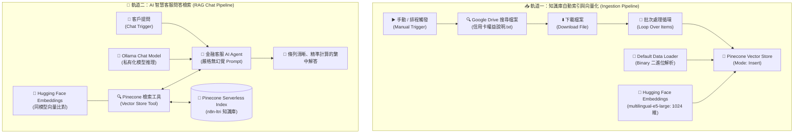

# 🗄️ 雲端資料庫整合
## 範例 8：Pinecone 向量庫與 Ollama 本地模型——信用卡權益客服 RAG 雙軌實戰

> 💡 **企業私有化與多語言 AI 實戰**  
> 本範例整合 **Google Drive 雲端自動同步**、**Hugging Face 多語言向量嵌入 (`multilingual-e5-large`)**、**Pinecone 雲端向量庫** 與 **Ollama 私有化本地語言模型**，打造金融級「零幻覺、精準計算」的智慧信用卡客服問答系統！

---

### 📚 工作流程說明

在真實企業場景中，知識庫更新頻繁且客戶諮詢要求**極度精準、零幻覺、具備嚴格的條款計算能力**。本範例在單一畫布上實現**雙軌一體化架構**：

1. **軌道一：知識庫自動索引管道（Ingestion Pipeline）**
   - **Google Drive 監聽與搜尋**：自動搜尋 Google 雲端硬碟中的 `信用卡權益說明.txt` 文件並下載二進位檔案。
   - **批次循環處理（Loop Over Items）**：透過 Split In Batches 確保大檔案或多文件穩定處理。
   - **多語言高維向量嵌入**：使用 Hugging Face `intfloat/multilingual-e5-large` 模型（1024 維度），對繁體中文及多國語言具備極佳的語意表徵能力。
   - **寫入 Pinecone 向量庫**：自動切塊並持久化儲存於雲端 Serverless 向量空間。

2. **軌道二：AI 客服智能問答管道（RAG Chat Pipeline）**
   - **對話觸發器（Chat Trigger）**：提供直覺的即時對話介面。
   - **AI Agent + Pinecone 檢索工具**：動態調用向量檢索工具獲取最新信用卡權益條款。
   - **Ollama 私有模型推理**：串接本地或私有雲部署的 Ollama 模型（如 `gemma4:31b-cloud`、`gemma2` 或 `llama3`），兼顧企業資料隱私與高推理效能。
   - **嚴格金融級 Prompt 規範**：系統提示詞嚴格限制「僅根據文件回答，未提及者回答未提及，需計算者精準依內容計算」，杜絕模型胡言亂語。

---

### 🧭 雙軌工作流程架構圖



---

### 📥 工作流程與測試檔案下載

- [📥 下載工作流程：08_pinecone_ollama_rag.json](./08_pinecone_ollama_rag.json)
- [📄 下載測試文件：信用卡權益說明.txt](./信用卡權益說明.txt)（可直接上傳至 Google Drive 進行測試）

---

## 🛠️ 前置準備與環境設定

### 1. Pinecone 建立 1024 維度向量索引（免信用卡設定）
> ⚠️ **重要注意事項（免費區域與維度匹配）**：  
> - **免費地區限制**：Pinecone 免費 Starter 方案僅在美國 **AWS `us-east-1` (N. Virginia，維吉尼亞州)** 提供完全免費、免綁信用卡的 Serverless 額度。請勿選錯區域以避免出現付費提示。
> - **向量維度匹配**：本範例使用的 Hugging Face `intfloat/multilingual-e5-large` 輸出維度為 **`1024`**。
> 
> 建立 Pinecone Index 時請務必設定：
> - **Index Name**：例如 `n8n-ltri`（需與節點中名稱一致）
> - **Dimensions（向量維度）**：**`1024`**（不可填錯，建立後無法更改）
> - **Metric（距離演算法）**：**`cosine`**
> - **Cloud Provider**：選擇 **`AWS`**
> - **Region**：選擇 **`us-east-1` (Virginia)**
> - **Capacity Mode**：**`Serverless`**

### 2. Hugging Face Inference API Token 設定
1. 前往 [Hugging Face 官方網站](https://huggingface.co/) 註冊並登入。
2. 進入 **Settings ➔ Access Tokens** 建立一組 Token（選擇 `Read` 權限）。
3. 在 n8n 的 **Credentials ➔ Hugging Face API** 填入 Token 即可使用。

### 3. Ollama 本地 / 雲端模型啟動
若使用本機 Ollama：
1. 安裝並啟動 Ollama：
   ```bash
   ollama run gemma2:9b
   # 或依照工作流預設模型
   ollama pull gemma2
   ```
2. 在 n8n 的 **Credentials ➔ Ollama** 設定 Base URL（預設為 `http://localhost:11434` 或區域網路 IP）。
3. 如需跨主機連線，請確保 Ollama 環境變數已設置 `OLLAMA_ORIGINS="*"`。

### 4. Google Drive 準備測試檔案
1. 將本範例提供的 [`信用卡權益說明.txt`](./信用卡權益說明.txt) 上傳至您的 Google Drive 根目錄。
2. 在 n8n 中配置 **Google Drive OAuth2** 憑證。

---

## 📋 節點詳細說明

| 節點名稱 | 類型 | 功能說明 |
| :--- | :--- | :--- |
| **When clicking ‘Execute workflow’** | `Manual Trigger` | 一鍵啟動知識庫建立與索引流程。 |
| **Search files and folders** | `Google Drive` | 在雲端硬碟搜尋檔名包含 `信用卡權益說明.txt` 的檔案 ID。 |
| **Download file** | `Google Drive` | 依據取得的檔案 ID 下載檔案二進位資料。 |
| **Loop Over Items** | `Split in Batches` | 批次循環處理下載的檔案，提升穩定度。 |
| **Pinecone Vector Store (Insert)** | `LangChain Vector Store` | 將二進位文件內容切塊、向量化並寫入 Pinecone。 |
| **Default Data Loader** | `Document Loader` | 負責解析 Binary 資料並提取純文字內容。 |
| **Embeddings HuggingFace Inference** | `Embeddings` | 調用 `intfloat/multilingual-e5-large` 生成 1024 維語意向量。 |
| **When chat message received** | `Chat Trigger` | 提供客戶對話視窗。 |
| **AI Agent** | `LangChain Agent` | 核心對話大腦，限制僅依據檢索到的文件回答。 |
| **Ollama Chat Model** | `Chat Model` | 私有化語言模型推理引擎。 |
| **Pinecone Vector Store1 (Tool)** | `Vector Store Tool` | 將 Pinecone 向量庫包裝成 AI 工具，供 Agent 自主檢索。 |

---

## 🧪 實戰測試與對話驗證

建立完成後，先執行一次上半部的工作流程建立向量索引，接著開啟 Chat 視窗進行提問測試：

### 測試案例 1：精準權益查詢
- **提問**：`「請問極緻無限黑金卡的年費是多少？怎樣可以免年費？」`
- **AI 回答預期**：
  > 根據信用卡權益說明文件：
  > - **正卡年費**：新台幣 24,000 元整。
  > - **免年費條件**：年度累積消費達新台幣 100 萬元以上，享次年免年費優惠。

### 測試案例 2：跨卡片條款計算題
- **提問**：`「如果我持有商務御璽翱翔卡，這個月買機票刷了 50,000 元，可以拿到多少現金回饋？」`
- **AI 回答預期**：
  > 根據文件規範：
  > - 商務御璽翱翔卡之航空機票與海外飯店享 2.5% 現金回饋。
  > - 計算：$50,000 \times 2.5\% = 1,250$ 元。
  > - 由於未超過該通路每月回饋上限新台幣 2,000 元，因此您可以獲得 **新台幣 1,250 元** 現金回饋。

### 測試案例 3：防幻覺邊界測試（文件未提及）
- **提問**：`「請問有沒有提供免費道路救援服務？」`
- **AI 回答預期**：
  > 文件中未提及。

---

## 💡 常見問題與除錯指南

1. **向量搜尋報錯 `Vector dimension 1024 does not match index dimension 1536`**：
   - 原因：Pinecone Index 的維度與 Hugging Face 模型輸出維度不一致。
   - 解決方法：重新建立一個維度為 `1024` 的 Pinecone Index。

2. **Ollama 連線失敗 (Connection Refused)**：
   - 原因：n8n 容器或遠端伺服器無法存取本機 Ollama 服務。
   - 解決方法：
     - 若 n8n 在 Docker 中執行，Base URL 請設為 `http://host.docker.internal:11434`。
     - 啟動 Ollama 時設定環境變數 `OLLAMA_HOST=0.0.0.0`。
