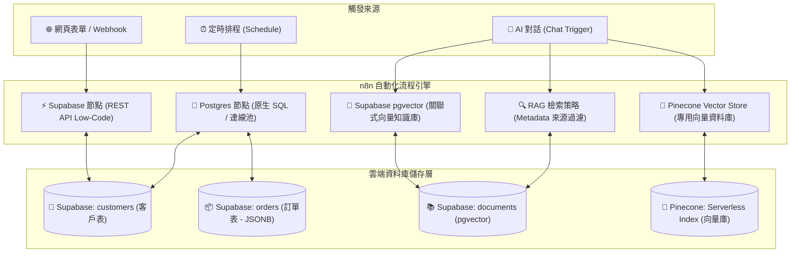

# 🗄️ 雲端資料庫與向量知識庫整合（PostgreSQL, Supabase & Pinecone 實戰）

歡迎來到 **n8n 雲端資料庫與向量知識庫整合教學**！在現代企業自動化系統中，資料庫是用來**持久化儲存業務數據**、**維護工單狀態機**、**跨系統資料同步**以及**為 AI 提供私有向量知識庫（RAG / Vector Store）**的核心基礎設施。

本章節涵蓋全球最受歡迎的開源關聯式資料庫 **PostgreSQL**、雲端全端資料庫平台 **Supabase (pgvector)**，以及業界標準的免費用量無伺服器向量資料庫 **Pinecone**，帶領您由淺至深掌握資料庫操作與企業級 RAG 語意檢索技術。

> 💡 **AI 協作時代學習法**：在完成基礎節點設定並透過 MCP 連線 AI（Gemini、ChatGPT 或 Claude）後，您可以直接複製各範例中的 **「AI 賦能延伸實作」** 折疊區塊（`<details>`）內的 Prompt 提詞，由 AI 助理替您在畫布上全自動建構與擴充進階邏輯！

---

## 📌 前置準備與連線設定

在開始實作以下範例前，請先完成資料庫專案建立與連線憑證設定（皆為**完全免費、免綁信用卡**方案）：

> 🔑 **完整設定指南**：
> 1. [🐘 Supabase 註冊、OAuth 與連線參數設定指南](./Supabase/README.md)
> 2. [📜 Supabase 一鍵建表 SQL 腳本 (schema.sql)](./Supabase/schema.sql)（包含客戶表、訂單表與 pgvector 向量表）
> 3. [🌲 Pinecone 免費 Starter 方案與 Serverless 索引建立指南](./07_Pinecone雲端向量資料庫與AI檢索/README.md#免費建立-pinecone不用花錢步驟指南)

---

## 🧭 資料庫整合核心架構



---

## 📚 實作範例導覽（由淺至深 7 大範例）

本教學規劃了七個循序漸進、兼具理論與實務價值的實作範例：

---

### 1. [範例 1：Postgres 基礎 CRUD 與資料讀寫（SQL 增刪查改）](./01_Postgres基礎CRUD與資料讀寫/README.md)

**難度**：入門 🟢 ｜ **核心技術**：Postgres Node (SQL)

學習如何在 n8n 中使用 Postgres 節點執行標準 SQL 語句，透過安全的參數化查詢（`$1, $2, ...`）完成客戶資料的新增、查詢、VIP 等級更新與刪除。

- **學習重點**：PostgreSQL 連線配置、參數化防注入、`RETURNING *` 技巧、標準 CRUD 生命週期。
- **附帶樣版**：[`01_postgres_crud.json`](./01_Postgres基礎CRUD與資料讀寫/01_postgres_crud.json)

---

### 2. [範例 2：Supabase Low-Code 節點與資料表自動化（免寫 SQL 快速存取）](./02_Supabase節點與資料表存取/README.md)

**難度**：初級 🟢 ｜ **核心技術**：Supabase Node (REST API)

免寫 SQL 也能操作雲端資料庫！透過 Supabase REST API 節點，以視覺化下拉選單挑選資料表與欄位，快速完成表單資料寫入與特定條件過濾。

- **學習重點**：Project URL 與 API Key 授權、視覺化新增/讀取資料列、過濾器（Filters: `vip_level eq Gold`）。
- **附帶樣版**：[`02_supabase_lowcode.json`](./02_Supabase節點與資料表存取/02_supabase_lowcode.json)

---

### 3. [範例 3：電商訂單 Upsert 與跨表關聯統計報表（防重複與大數據聚合）](./03_電商訂單Upsert與關聯統計/README.md)

**難度**：初中級 🟡 ｜ **核心技術**：PostgreSQL `ON CONFLICT` 與 `LEFT JOIN`

實戰企業級防重複寫入與多表關聯運算！使用 `ON CONFLICT (email) DO UPDATE` 自動更新客戶資料，並執行 `LEFT JOIN ... GROUP BY` 即時產出客戶消費排行榜。

- **學習重點**：Upsert 防重複與 Race Condition、跨表 JOIN 關聯查詢、資料庫端高效率聚合運算。
- **附帶樣版**：[`03_ecommerce_upsert_analytics.json`](./03_電商訂單Upsert與關聯統計/03_ecommerce_upsert_analytics.json)

---

### 4. [範例 4：資料庫變更即時偵測與 Telegram/LINE 告警推播（狀態監控與通知閉環）](./04_資料庫變更偵測與即時推播/README.md)

**難度**：中級 🟡 ｜ **核心技術**：Schedule Trigger + Postgres + Telegram

監控資料庫最新異動！每分鐘排程自動撈取 `status = 'pending'` 的待處理新訂單，透過 Telegram 發送富文本通知，並自動回寫狀態為 `processing`，形成防重複閉環。

- **學習重點**：定時輪詢監控模式、Telegram Markdown 富文本排版、狀態機更新閉環。
- **附帶樣版**：[`04_db_trigger_notification.json`](./04_資料庫變更偵測與即時推播/04_db_trigger_notification.json)

---

### 5. [範例 5：Supabase pgvector 向量知識庫與 RAG 智能問答（PostgreSQL 變身 AI 大腦）](./05_Supabase_pgvector向量知識庫/README.md)

**難度**：進階 🔴 ｜ **核心技術**：pgvector + Embeddings + AI Agent (RAG)

將 PostgreSQL 升級為 AI 向量知識庫！啟用 `pgvector` 擴充套件，透過 n8n Supabase Vector Store 節點與 Embeddings 模型，實現零幻覺的企業私有知識庫問答系統（包含本機文件切塊寫入與 Google Drive 同步範例）。

- **學習重點**：`pgvector` 向量擴充與 1536 維向量欄位、Embeddings 語意轉換、LangChain Vector Store Retriever、AI Agent 知識庫問答。
- **附帶樣版**：[`Supabase_RAG_智能問答.json`](./05_Supabase_pgvector向量知識庫/Supabase_RAG_智能問答.json)

---

### 6. [範例 6：RAG 檢索策略與 Metadata 來源過濾（精準語意搜尋）](./06_RAG檢索策略與來源過濾/README.md)

**難度**：進階 🔴 ｜ **核心技術**：自然語言意圖識別 + 動態 Metadata Filter + Postgres Memory

單純語意相似度不夠用？實戰高階 Metadata Filtering！使用者提問「從 Google Drive 查...」或「從本機檔案找...」時，系統自動偵測來源並動態注入 JSONB 過濾條件，兼具 Postgres 連續對話歷史記憶。

- **學習重點**：自然語言關鍵字識別、動態注入 `where: { source: ... }` 結構、Postgres Chat Memory 對話狀態持久化。
- **附帶樣版**：[`RAG_進階檢索_來源過濾.json`](./06_RAG檢索策略與來源過濾/RAG_進階檢索_來源過濾.json)

---

### 7. [範例 7：Pinecone 雲端向量資料庫與 AI 檢索（免費 Serverless 專用向量庫）](./07_Pinecone雲端向量資料庫與AI檢索/README.md)

**難度**：進階 🔴 ｜ **核心技術**：Pinecone Serverless + Google Drive + AI Agent

使用業界最熱門的專用雲端向量資料庫 **Pinecone**（免費 Starter 方案），建立 Serverless 向量索引，體驗毫秒級高併發向量檢索與零維護成本的 RAG 智慧問答。

- **學習重點**：Pinecone Serverless 索引建立、維度匹配、Pinecone Vector Store 節點串接、專用向量庫架構選型。
- **附帶樣版**：[`06_pinecone_vector_rag.json`](./07_Pinecone雲端向量資料庫與AI檢索/06_pinecone_vector_rag.json)

---

## 📊 資料庫與向量檢索方案評估比較

| 評估維度 | 🐘 Supabase (PostgreSQL) | 🌲 Pinecone (Serverless) |
| :--- | :--- | :--- |
| **資料庫類型** | 關聯式資料庫 + pgvector 擴充 | 專用向量資料庫 (Vector-Native) |
| **免費方案額度** | 500 MB 儲存空間、50,000 月活躍用戶 | 1 個 Index、2 GB 儲存、每月免費查詢額度 |
| **信用卡綁定** | **完全無需信用卡** | **完全無需信用卡** |
| **核心優勢** | 單一資料庫搞定「業務表 + 訂單 + 向量」 | 毫秒級高併發檢索、Serverless 零運維 |
| **適用場景** | 全端自動化、電商 CRM、中小企業一站式方案 | 大規模知識庫、專業 AI 搜尋、高併發 RAG 應用 |

---

## 🎯 學習路徑建議

```
【第一階段：關聯式資料庫基礎】
1. Postgres 基礎 CRUD ➔ 掌握原生 SQL 語法與防注入參數化查詢
2. Supabase Low-Code 節點 ➔ 掌握 REST API 無程式碼表格存取

【第二階段：業務邏輯與狀態機】
3. 電商訂單 Upsert 與跨表統計 ➔ 掌握 ON CONFLICT 防重複與多表 JOIN 聚合
4. 資料庫變更偵測與推播 ➔ 掌握定時輪詢監控與通訊軟體通知閉環

【第三階段：RAG 向量知識庫旗艦實戰】
5. Supabase pgvector 向量知識庫 ➔ 掌握 PostgreSQL 向量化儲存與 RAG 檢索
6. RAG 檢索策略與來源過濾 ➔ 掌握自然語言意圖識別與動態 Metadata 過濾
7. Pinecone 雲端向量資料庫 ➔ 掌握專用 Serverless 向量資料庫架構
```
