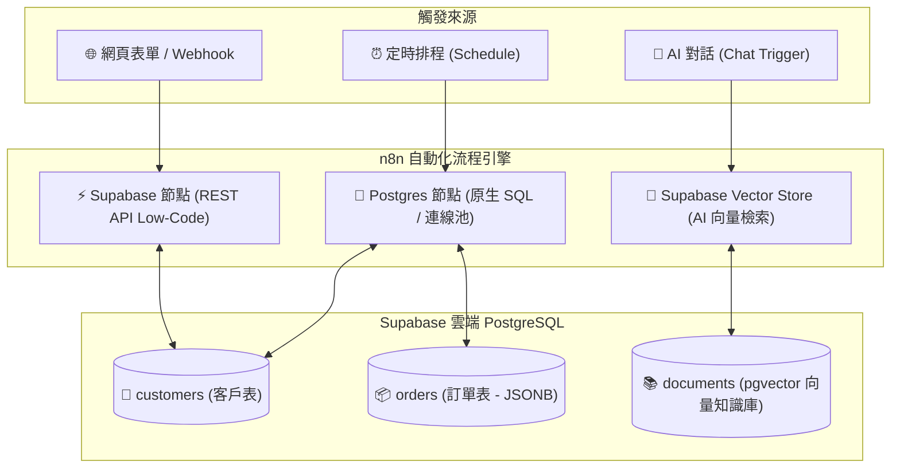

# 🗄️ 雲端資料庫整合（PostgreSQL & Supabase 實戰）

歡迎來到 **n8n 雲端資料庫整合教學**！在現代企業自動化系統中，資料庫是用來**持久化儲存業務數據**、**維護工單狀態機**、**跨系統資料同步**以及**為 AI 提供私有向量知識庫（RAG / Vector Store）**的核心基礎設施。

本章節以全球最受歡迎的開源關聯式資料庫 **PostgreSQL** 為核心，並以最適合教學與快速上手的雲端託管平台 **Supabase** 作為主要實作環境，帶領您由淺至深掌握資料庫操作技巧。

> 💡 **AI 協作時代學習法**：在完成基礎節點設定並透過 MCP 連線 AI（Gemini、ChatGPT 或 Claude）後，您可以直接複製各範例中的 **「AI 賦能延伸實作」** 折疊區塊（`<details>`）內的 Prompt 提詞，由 AI 助理替您在畫布上全自動建構與擴充進階邏輯！

---

## 📌 前置準備與連線設定

在開始實作以下範例前，請先完成 Supabase 專案建立與連線憑證設定：

> 🔑 **完整設定指南**：
> - [🐘 Supabase 註冊、OAuth 與連線參數設定指南](./Supabase/README.md)
> - [📜 一鍵建表 SQL 腳本 (schema.sql)](./Supabase/schema.sql)（包含客戶表、訂單表與 pgvector 向量表）

---

## 🧭 資料庫整合核心架構



---

## 📚 實作範例導覽（由淺至深）

本教學規劃了五個循序漸進、兼具理論與實務價值的實作範例：

---

### 1. [範例 1：Postgres 基礎 CRUD 與資料讀寫（SQL 增刪查改）](./01_Postgres基礎CRUD與資料讀寫/README.md)

**難度**：入門 🟢 ｜ **核心技術**：Postgres Node (SQL)

學習如何在 n8n 中使用 Postgres 節點執行標準 SQL 語句，透過安全的參數化查詢（`$1, $2, ...`）完成客戶資料的新增、查詢、VIP 等級更新與刪除。

**學習重點**：
- PostgreSQL 連線配置與 SSL 需求
- 參數化查詢防止 SQL 注入攻擊
- 使用 `RETURNING *` 技巧一次完成操作與回傳
- 標準關聯式資料庫 CRUD 生命週期

- **附帶樣版**：[`01_postgres_crud.json`](./01_Postgres基礎CRUD與資料讀寫/01_postgres_crud.json)

<details>
<summary>🤖 <strong>AI 賦能延伸實作（附 Prompt 提詞）</strong></summary>

> 💡 **任務目標**：透過 MCP 連線，讓 AI 增加軟刪除（Soft Delete）機制與審計欄位。

**可直接複製給 AI 的 Prompt 提詞**：
```text
請幫我在目前的「Postgres 基礎 CRUD」工作流程中加入軟刪除（Soft Delete）邏輯：
1. 在資料庫中執行 ALTER TABLE public.customers ADD COLUMN IF NOT EXISTS is_deleted BOOLEAN DEFAULT false;
2. 新增一個 Postgres 節點：「軟刪除客戶」，執行 UPDATE public.customers SET is_deleted = true, updated_at = NOW() WHERE email = $1 RETURNING *;
3. 修改查詢節點，加入條件 WHERE is_deleted = false。
請幫我配置好 SQL 語句與節點連線！
```
</details>

---

### 2. [範例 2：Supabase Low-Code 節點與資料表自動化（免寫 SQL 快速存取）](./02_Supabase節點與資料表存取/README.md)

**難度**：初級 🟢 ｜ **核心技術**：Supabase Node (REST API)

免寫 SQL 也能操作雲端資料庫！透過 Supabase REST API 節點，以視覺化下拉選單挑選資料表與欄位，快速完成表單資料寫入與特定條件過濾。

**學習重點**：
- Supabase Project URL 與 API Key (Anon / Service Role) 授權
- 無程式碼（Low-Code）建立與讀取資料列
- 條件過濾器（Filters: `vip_level eq Gold`）
- 適合前端表單串接與快速原型開發

- **附帶樣版**：[`02_supabase_lowcode.json`](./02_Supabase節點與資料表存取/02_supabase_lowcode.json)

<details>
<summary>🤖 <strong>AI 賦能延伸實作（附 Prompt 提詞）</strong></summary>

> 💡 **任務目標**：透過 MCP 連線，當新會員為 Gold 等級時，自動寄送尊榮迎賓 Email。

**可直接複製給 AI 的 Prompt 提詞**：
```text
請幫我在「Supabase Low-Code 節點」工作流程中加入條件通知：
1. 在「Supabase 寫入客戶」節點後，接續一個 IF 條件判斷。
2. 判斷條件：vip_level === "Gold"。
3. 在 True 分支連接 Gmail 節點，發送主題為「歡迎成為尊榮 Gold VIP 會員！」的專屬迎賓信。
請幫我建立相關節點與連線！
```
</details>

---

### 3. [範例 3：電商訂單 Upsert 與跨表關聯統計報表（防重複與大數據聚合）](./03_電商訂單Upsert與關聯統計/README.md)

**難度**：初中級 🟡 ｜ **核心技術**：PostgreSQL `ON CONFLICT` 與 `LEFT JOIN`

實戰企業級防重複寫入與多表關聯運算！使用 `ON CONFLICT (email) DO UPDATE` 自動更新客戶資料，並執行 `LEFT JOIN ... GROUP BY` 即時產出客戶消費排行榜。

**學習重點**：
- Upsert（新增或更新）避免資料重複與 Race Condition
- 跨資料表關聯查詢（`customers` JOIN `orders`）
- 聚合函數（`COUNT`, `SUM`, `COALESCE`）
- 在資料庫端完成高效率統計，節省 n8n 運算資源

- **附帶樣版**：[`03_ecommerce_upsert_analytics.json`](./03_電商訂單Upsert與關聯統計/03_ecommerce_upsert_analytics.json)

<details>
<summary>🤖 <strong>AI 賦能延伸實作（附 Prompt 提詞）</strong></summary>

> 💡 **任務目標**：透過 MCP 連線，讓 AI 將統計報表自動轉為 Markdown 表格並發送至 Telegram。

**可直接複製給 AI 的 Prompt 提詞**：
```text
請幫我在「電商訂單 Upsert 與跨表統計」工作流程後方加入自動報表發送：
1. 取得跨表統計結果後，串接一個 Code 節點，將資料轉換為 Markdown 表格字串（包含：排名、客戶姓名、VIP等級、訂單數、總金額）。
2. 串接 Telegram 節點，發送主題為「📊 本週 VIP 客戶消費貢獻排行」的即時推播。
請幫我配置好程式碼與節點連線！
```
</details>

---

### 4. [範例 4：資料庫變更即時偵測與 Telegram/LINE 告警推播（狀態監控與通知閉環）](./04_資料庫變更偵測與即時推播/README.md)

**難度**：中級 🟡 ｜ **核心技術**：Schedule Trigger + Postgres + Telegram

監控資料庫最新異動！每分鐘排程自動撈取 `status = 'pending'` 的待處理新訂單，透過 Telegram 發送富文本通知，並自動回寫狀態為 `processing`，形成防重複閉環。

**學習重點**：
- 定時輪詢與資料庫狀態監控模式
- Telegram Markdown 富文本格式化排版
- 狀態機（Pending ➔ Processing）更新閉環設計
- 避免重發通知的防呆邏輯

- **附帶樣版**：[`04_db_trigger_notification.json`](./04_資料庫變更偵測與即時推播/04_db_trigger_notification.json)

<details>
<summary>🤖 <strong>AI 賦能延伸實作（附 Prompt 提詞）</strong></summary>

> 💡 **任務目標**：透過 MCP 連線，當訂單金額超過 5,000 元時，額外發送高單價大額訂單特急警報。

**可直接複製給 AI 的 Prompt 提詞**：
```text
請幫我在「資料庫變更偵測」流程中加入大額訂單分流：
1. 在查詢出 pending 訂單後，串接 IF 節點判斷 total_amount >= 5000。
2. 若為 True，發送帶有 🚨 符號的「VIP 大額特急訂單」推播給主管群組。
3. 若為 False，發送一般 Telegram 訂單通知。
4. 兩條分支最後皆匯流至更新狀態為 processing 節點。
請幫我配置好 IF 條件與分支連線！
```
</details>

---

### 5. [範例 5：Supabase pgvector 向量知識庫與 AI 語意搜尋（PostgreSQL 變身 AI 大腦）](./05_pgvector向量知識庫與AI語意搜尋/README.md)

**難度**：進階 🔴 ｜ **核心技術**：pgvector + AI Agent (RAG)

將 PostgreSQL 升級為 AI 向量知識庫！啟用 `pgvector` 擴充套件，透過 n8n Supabase Vector Store 節點與 Embeddings 模型，實現零幻覺的企業規章語意檢索系統。

**學習重點**：
- `pgvector` 擴充功能與 1536 維向量欄位宣告
- 向量餘弦相似度搜尋函數（RPC `match_documents`）
- LangChain Supabase Vector Store 節點配置
- AI Agent 結合私有知識庫問答（RAG 實戰）

- **附帶樣版**：[`05_supabase_pgvector_rag.json`](./05_pgvector向量知識庫與AI語意搜尋/05_supabase_pgvector_rag.json)

<details>
<summary>🤖 <strong>AI 賦能延伸實作（附 Prompt 提詞）</strong></summary>

> 💡 **任務目標**：透過 MCP 連線，讓 AI 增加來源 Metadata 過濾（例如只搜尋 `category: "hr"` 的員工手冊）。

**可直接複製給 AI 的 Prompt 提詞**：
```text
請幫我在「Supabase pgvector」流程中加入 Metadata 過濾機制：
1. 修改 match_documents 呼叫設定，傳入 filter 條件：{"category": "hr"}。
2. 讓 AI Agent 僅能在人力資源規章範圍內檢索請假與出勤相關政策。
請幫我配置好檢索工具的過濾參數！
```
</details>

---

## 🏆 為什麼教學選擇 PostgreSQL 與 Supabase？

1. **業界標準與高相容性**：PostgreSQL 是目前全球最受推崇的開源關聯式資料庫，支援強型別、JSONB 結構化/半結構化混合資料，以及完善的 ACID 交易特性。
2. **免費用量最友善**：Supabase 提供永久免費專案，內含 500MB 資料庫儲存空間與 50,000 月活躍用戶，足夠教學與中小型專案使用。
3. **直覺的視覺化介面**：Supabase 內建類似 Airtable/Excel 的 Table Editor，初學者在 n8n 寫入資料後可立即在網頁上看到成果。
4. **一站式支援 AI 向量（pgvector）**：無需額外付費或架設專用向量資料庫，直接在 Supabase 開啟 `pgvector` 即可實現 RAG 知識庫檢索。

---

## 📊 常見免費雲端 PostgreSQL 服務評估

| 雲端服務 | 推薦等級 | 免費用量特點 | 核心優勢 | 適用場景 |
| :--- | :---: | :--- | :--- | :--- |
| **Supabase** (推薦首選) | ⭐⭐⭐⭐⭐ | 500 MB 儲存空間、無休眠限制 | 內建 Table Editor、REST API、Auth 與 **pgvector** | **教學示範、全端專案、AI RAG 應用** |
| **Neon** | ⭐⭐⭐⭐ | 0.5 GiB 儲存、支援分支 (Branching) | Serverless 秒級啟動、支援資料庫 Git 分支版本控制 | 團隊協作、CI/CD 測試、現代雲原生開發 |
| **Aiven** | ⭐⭐⭐ | 免費試用方案 | 提供多雲 (AWS/GCP/Azure) 託管 | 企業多雲容災備份測試 |
| **Render** | ⭐⭐⭐ | 免費 1 GB（注意：免費 DB 每月有運行時數限制） | 適合與 Render 上的 Web 服務一鍵綁定 | 與 Node.js / Python 容器一起部署 |

---

## 🎯 學習路徑建議

```
[入門基礎]
1. Postgres 基礎 CRUD ➔ 掌握原生 SQL 語法與防注入參數化查詢
2. Supabase Low-Code 節點 ➔ 掌握 REST API 無程式碼表格存取

[中階進階]
3. 電商訂單 Upsert 與跨表統計 ➔ 掌握 ON CONFLICT 防重複與多表 JOIN 聚合
4. 資料庫變更偵測與推播 ➔ 掌握定時輪詢監控與通訊軟體通知閉環

[旗艦 AI 應用]
5. Supabase pgvector 向量知識庫 ➔ 掌握 AI Agent 向量化與 RAG 私有知識庫檢索
```

---

## 📚 相關資源

- [Supabase 官方連線設定指南](./Supabase/README.md)
- [Supabase 官方網站](https://supabase.com/)
- [PostgreSQL 官方 SQL 手冊](https://www.postgresql.org/docs/)
- [pgvector 官方 GitHub](https://github.com/pgvector/pgvector)
- [🤖 整合 LLM 模型的 AI Agent 教學](../AI_Agent/README.md)
- [💬 通訊軟體整合 (LINE & Telegram)](../通訊軟體整合/README.md)
