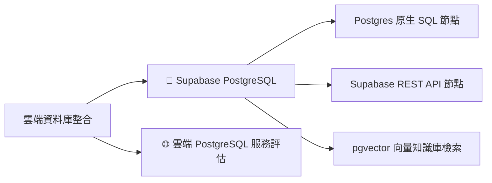

# 🗄️ 雲端資料庫整合實作 (Cloud Database Integration)

在自動化流程中，資料庫是用來**持久化儲存業務資料**、**維持狀態**與**提供 AI 知識庫（RAG / Vector Store）**的核心設施。

本章節以全球最受歡迎的開源關聯式資料庫 **PostgreSQL** 為核心，並以最適合教學與快速上手的雲端平台 **Supabase** 作為主要實作環境。

---

## 🧭 章節導覽

### 1. [🐘 Supabase (PostgreSQL) 實作指南](./Supabase/README.md)
* **核心功能**：
  - Supabase 專案建立與資料表設計（提供開箱即用的 [`schema.sql`](./Supabase/schema.sql)）。
  - n8n **Postgres 節點**：支援原生 SQL 語句、參數化查詢、防注入機制與 Upsert。
  - n8n **Supabase 節點**：透過 REST API 進行 Low-Code 表格存取。
  - **進階 pgvector**：儲存文字 Embedding 並進行向量語意相似度檢索（結合 AI Agent RAG）。
* **附帶資源**：[`supabase_crud_workflow.json`](./Supabase/supabase_crud_workflow.json)、[`schema.sql`](./Supabase/schema.sql)

---

## 🏆 為什麼教學選擇 PostgreSQL 與 Supabase？

1. **業界標準與高相容性**：PostgreSQL 是目前全球最受推崇的開源關聯式資料庫，支援強型別、JSONB 結構化/半結構化混合資料，以及完善的 ACID 交易特性。
2. **免費用量最友善**：Supabase 提供永久免費專案，內含 500MB 資料庫儲存空間與 50,000 月活躍用戶，足夠教學與中小型專案使用。
3. **直覺的視覺化介面**：Supabase 內建類似 Airtable/Excel 的 Table Editor，初學者在 n8n 寫入資料後可立即在網頁上看到成果。
4. **一站式支援 AI 向量（pgvector）**：無需額外付費或架設 Pinecone/Milvus 等專用向量資料庫，直接在 Supabase 開啟 `pgvector` 即可實現 RAG 知識庫檢索。

---

## 📊 常見免費雲端 PostgreSQL 服務比較與建議

若未來有不同場景的需求，以下是目前主流的雲端 PostgreSQL 服務比較：

| 雲端服務 | 推薦等級 | 免費用量特點 | 核心優勢 | 適用場景 |
| :--- | :---: | :--- | :--- | :--- |
| **Supabase** (推薦首選) | ⭐⭐⭐⭐⭐ | 500 MB 儲存空間、無休眠限制 | 內建 Table Editor、REST API、Auth 與 **pgvector** | **教學示範、全端專案、AI RAG 應用** |
| **Neon** | ⭐⭐⭐⭐ | 0.5 GiB 儲存、支援分支 (Branching) | Serverless 秒級啟動、支援資料庫 Git 分支版本控制 | 團隊協作、CI/CD 測試、現代雲原生開發 |
| **Aiven** | ⭐⭐⭐ | 免費試用方案 | 提供多雲 (AWS/GCP/Azure) 託管 | 企業多雲容災備份測試 |
| **Render** | ⭐⭐⭐ | 免費 1 GB（注意：免費 DB 每月有運行時數限制） | 適合與 Render 上的 Web 服務一鍵綁定 | 與 Node.js / Python 容器一起部署 |

---

## 🚀 學習路徑建議

1. **建立觀念**：閱讀 [Supabase 實作教學](./Supabase/README.md)，了解如何註冊並取得連線金鑰。
2. **匯入資料表**：使用專案提供的 [`schema.sql`](./Supabase/schema.sql) 快速在 Supabase 建立客戶與訂單資料表。
3. **匯入工作流程**：在 n8n 中匯入 [`supabase_crud_workflow.json`](./Supabase/supabase_crud_workflow.json) 體驗資料的新增、Upsert 與跨表統計查詢。
4. **整合應用**：嘗試將前一章節的 **LINE / Telegram 機器人** 與 Supabase 結合，將用戶傳來的訊息與訂單自動寫入資料庫！
