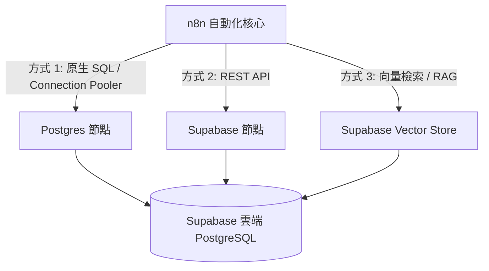

# 🐘 Supabase (PostgreSQL) 雲端資料庫整合實作

本教學介紹如何在 n8n 中整合最熱門的開源雲端 PostgreSQL 服務 —— **Supabase**。學習如何透過 n8n 進行資料表設計、SQL 查詢、CRUD（增刪查改）自動化，以及如何結合 `pgvector` 擴充套件打造 AI 知識庫向量檢索系統。

---

## 🌟 為什麼教學首選 Supabase？



1. **原汁原味的 PostgreSQL**：背後是標準的 PostgreSQL 資料庫，支援所有 SQL 語法、觸發器、儲存程序與關聯式設計。
2. **極致友善的 Web UI 介面**：提供像 Excel 一樣簡單易用的 Table Editor（資料表編輯器）與 SQL Editor（腳本執行器），非常適合教學展示。
3. **靈活的雙連線模式**：
   - **Postgres 節點**：直接使用 SQL 語句、參數化查詢與交易控制。
   - **Supabase 節點**：透過 REST API 進行無程式碼（Low-Code）快速存取。
4. **原生支援 pgvector 向量資料庫**：一鍵開啟向量儲存擴充，能直接與 n8n 的 **AI Agent / RAG 智能問答** 無縫接軌！
5. **免費方案非常充裕**：提供免費 500MB 資料庫儲存空間、50,000 個月活躍用戶與 REST API 存取。

---

## 🛠️ 第一步：Supabase 專案建立與連線設定

### 1. 建立 Supabase 專案
1. 前往 [Supabase 官方網站](https://supabase.com/) 並使用 GitHub 帳號註冊/登入。
2. 點擊 **New Project**，填寫專案名稱（例如：`n8n-learning`）並設定一組**強密碼 (Database Password)**（請妥善保存此密碼）。
3. 選擇離您最近的區域（例如：`Tokyo (ap-northeast-1)` 或 `Singapore (ap-southeast-1)`）。
4. 點擊 **Create new project**，等待約 1-2 分鐘完成佈署。

### 2. 取得連線參數 (Connection Info)

#### (1) Postgres Direct / Pooler 連線參數（供 Postgres 節點使用）
1. 進入專案左側選單的 **Project Settings (齒輪圖示)** -> **Database**。
2. 在 **Connection parameters** 或 **Connection pooling** 區塊中，可找到：
   - **Host**：例如 `aws-0-ap-northeast-1.pooler.supabase.com` 或 `db.xxxxxxxx.supabase.co`
   - **Port**：`5432`（直接連線）或 `6543`（連線池 Pooler，建議大量請求時使用）
   - **Database name**：`postgres`
   - **User**：`postgres.<你的專案ref>` 或 `postgres`
   - **Password**：您在建立專案時設定的密碼
   - **SSL**：`Require` (必須啟用 SSL)

#### (2) API 連線參數（供 Supabase 節點使用）
1. 前往 **Project Settings** -> **API**。
2. 取得：
   - **Project URL**：`https://xxxxxxxxxxxx.supabase.co`
   - **anon / public key** 或 **service_role key**（具備管理員權限）

---

## 📜 第二步：在 Supabase 建立教學用資料表

請直接在 Supabase 左側選單點選 **SQL Editor**，點擊 **New query**，並貼上專案提供的 [`schema.sql`](./schema.sql) 腳本執行：

```sql
-- 啟用向量擴充功能
CREATE EXTENSION IF NOT EXISTS vector;

-- 建立客戶資料表
CREATE TABLE IF NOT EXISTS public.customers (
    id BIGSERIAL PRIMARY KEY,
    name VARCHAR(100) NOT NULL,
    email VARCHAR(150) UNIQUE NOT NULL,
    phone VARCHAR(50),
    vip_level VARCHAR(20) DEFAULT 'Standard',
    created_at TIMESTAMPTZ DEFAULT NOW(),
    updated_at TIMESTAMPTZ DEFAULT NOW()
);

-- 建立訂單資料表
CREATE TABLE IF NOT EXISTS public.orders (
    id BIGSERIAL PRIMARY KEY,
    order_number VARCHAR(50) UNIQUE NOT NULL,
    customer_id BIGINT REFERENCES public.customers(id) ON DELETE CASCADE,
    total_amount NUMERIC(10, 2) NOT NULL DEFAULT 0.00,
    status VARCHAR(30) DEFAULT 'pending',
    items JSONB DEFAULT '[]'::JSONB,
    created_at TIMESTAMPTZ DEFAULT NOW()
);
```

執行完成後，點選左側的 **Table Editor** 即可看見視覺化的資料表與測試資料！

---

## 🔐 第三步：在 n8n 配置 PostgreSQL 憑證

1. 開啟 n8n 介面，點選左側選單的 **Credentials** -> **Add Credential**。
2. 搜尋並選擇 **Postgres**。
3. 填寫連線參數：
   - **Host**：Supabase Host（如 `aws-0-ap-northeast-1.pooler.supabase.com`）
   - **Database**：`postgres`
   - **User**：您的 Supabase 使用者名稱
   - **Password**：您的資料庫密碼
   - **Port**：`5432` 或 `6543`
   - **SSL**：切換為 **SSL (allow unauthorized)** 或 **TLS/SSL**
4. 點擊 **Save**，若出現綠色打勾表示連線成功！

---

## 🧩 第四步：n8n 工作流程實戰解析

我們提供了開箱即用的工作流程範本：[`supabase_crud_workflow.json`](./supabase_crud_workflow.json)。

### 1. 新增與 Upsert（避免重複寫入）
在電商或會員系統中，常需要「若 Email 存在則更新資料，若不存在則新增」。

在 **Postgres 節點** 中選擇 `Execute Query`：
```sql
INSERT INTO public.customers (name, email, phone, vip_level)
VALUES ($1, $2, $3, $4)
ON CONFLICT (email) DO UPDATE 
SET phone = EXCLUDED.phone, vip_level = EXCLUDED.vip_level, updated_at = NOW()
RETURNING *;
```
* **Query Parameters**：`={{ [$json.name, $json.email, $json.phone, $json.vip_level] }}`
* 採用參數化查詢（`$1, $2...`），可完全防止 SQL Injection 注入攻擊。

### 2. 跨表關聯查詢與統計（JOIN & GROUP BY）
查詢每位客戶的累計訂單數與總消費金額：
```sql
SELECT 
    c.id AS customer_id,
    c.name AS customer_name,
    c.email,
    c.vip_level,
    COUNT(o.id) AS total_orders,
    COALESCE(SUM(o.total_amount), 0) AS total_spent
FROM public.customers c
LEFT JOIN public.orders o ON c.id = o.customer_id
GROUP BY c.id, c.name, c.email, c.vip_level
ORDER BY total_spent DESC;
```

---

## 🤖 第五步：進階應用 — 結合 pgvector 打造 AI 向量知識庫

Supabase 內建的 `pgvector` 擴充套件，能將文本轉化為 1536 維度的向量進行語意檢索：

1. **寫入向量（Insert Documents）**：
   - 使用 n8n 的 **Supabase Vector Store** 節點搭配 **Embeddings OpenAI**。
   - 將產品手冊、常見問答（FAQ）切塊並寫入 `documents` 資料表。
2. **AI Agent 語意搜尋（Retrieve）**：
   - 當使用者在 LINE 或 Telegram 發問時，AI Agent 透過 Vector Store 檢索最相關的內容並生成回覆。

---

## 🤖 AI 賦能延伸實作（附 Prompt 提詞）

<details>
<summary>🤖 <strong>複製給 AI 助理的 Supabase 自動化升級 Prompt</strong></summary>

```text
請幫我在目前的「Supabase 雲端資料庫工作流程」中加入自動化訂單處理功能：
1. 前端接收 Webhook 傳來的訂單資料（包含 customer_email、items 陣列、total_amount）。
2. 第一步：先向 Supabase 查詢該客戶的 customer_id（若不存在則自動新建客戶）。
3. 第二步：在 orders 資料表中新增一筆訂單記錄，狀態設為 'paid'。
4. 第三步：檢查該客戶總累積消費金額是否超過 10,000 元，若是則將 vip_level 更新為 'VIP'。
5. 最後回傳 200 JSON 包含 order_number 與升級狀態。
請幫我建立相關 Postgres 節點與資料轉換邏輯！
```
</details>

---

## ⚠️ 常見連線問題與排錯指南

| 問題現象 | 原因分析 | 解決方式 |
| :--- | :--- | :--- |
| **連線逾時 (Connection Timeout)** | 網路環境不支援 IPv6 連線 | Supabase 預設直接連線可能使用 IPv6。請改用 **Session Pooler Host** 與連接埠 **6543**（支援 IPv4）。 |
| **SSL connection error** | PostgreSQL 要求強制加密連線 | 請在 n8n Postgres 憑證設定中將 **SSL** 選項開啟。 |
| **password authentication failed** | 資料庫密碼錯誤或含有未跳脫的特殊符號 | 前往 Supabase -> Project Settings -> Database 重設密碼後重新填入。 |
| **column does not exist** | SQL 欄位名稱大小寫問題 | PostgreSQL 預設會將欄位轉為小寫，若欄位在 Supabase 建立時帶有雙引號（如 `"userId"`），SQL 需使用雙引號包裹。 |

